# 2. Repository Overview

```mermaid
graph TB
    subgraph ROOT["farming_assistant_collage/"]
        direction TB
        B["Backend/"]
        ML["Ml-service/"]
        F["Frontend/"]
        D["docs/"]

        subgraph BACKEND["Backend (Node.js / Express 5)"]
            direction TB
            B1["app.js"]
            B2["package.json"]
            CFG["config/"]
            RT["routes/"]
            CTRL["controller/"]
            UC["usecases/"]
            ENT["entity/"]
            SVC["service/"]
            SVC_ENG["service/engine/"]
            INFRA["infrastructure/"]
            MDL["model/"]
            DTO["dto/"]
            MID["middlewares/"]
            SHARED["shared/"]
            TEST["test/service/"]
        end

        subgraph MLSERVICE["Ml-service (Python FastAPI)"]
            direction TB
            M_APP["app/"]
            M_MAIN["app/main.py"]
            M_MODEL["app/model.py"]
            M_CFG["app/config.py"]
            M_UTIL["app/util.py"]
            M_CLOUD["app/cloud.py"]
            M_TEST["app/test.py"]
            M_REQ["requirement.txt"]
            M_IMG["test_images/"]
        end

        B --- BACKEND
        ML --- MLSERVICE
    end

    style ROOT fill:#1a1a2e,color:#fff,stroke:#16213e
    style BACKEND fill:#0f3460,color:#fff,stroke:#16213e
    style MLSERVICE fill:#533483,color:#fff,stroke:#16213e
    style F fill:#2d2d2d,color:#888,stroke:#444,stroke-dasharray: 5 5
```



## Technology Stack

| Layer | Technology | Version |
|-------|-----------|---------|
| Backend Runtime | Node.js | >=20.x |
| Web Framework | Express | 5.2.1 |
| Database ODM | Mongoose | 9.6.2 |
| Validation | Zod | 4.4.2 |
| Authentication | jsonwebtoken + bcrypt | 9.0.3 / 6.0.0 |
| S3 SDK | @aws-sdk/client-s3 | 3.1045.0 |
| AI Service | @google/genai | 2.7.0 |
| ML Framework | TensorFlow + Keras | 2.16.1 / 3.12 |
| Python Web | FastAPI + Uvicorn | latest |
| Image Processing | Pillow | latest |

## Module Architecture

| Module | Route Prefix | Controller | Use Cases | Entity |
|--------|-------------|------------|-----------|--------|
| Auth | `/api/v1/auth` | auth.controller.js | auth.usecases.js | User |
| User | `/api/v1/users` | user.controller.js | user.usecases.js | User |
| Plant | `/api/v1/plants` | plant.controller.js | plant.usecase.js, disease-detection.usecase.js | Plant |
| Plant Care | `/api/v1/plants/:id/*` | plant-care.controller.js | plant-care.usecase.js (facade), plant-analyser.usecase.js, plant-care-action.usecase.js | Plant |
| Dashboard | `/api/v1/dashboard` | dashboard.controller.js | dashboard.usecase.js | Plant |

## Backend Directory Structure

### `config/`
- `config.env.example` — environment variable template
- `index.js` — loads and exports config values

### `routes/`
5 route files, one per module. All mounted in `app.js`.

### `controller/`
5 controllers. Each parses the request, delegates to its use case, and calls `HttpResponse.success()` or passes an error via `next(error)`. Controllers contain **zero business logic** and never import from the DI container.

### `usecases/`
8 use case files containing all business logic. Dependencies are imported from `shared/container.js`. Failures are thrown as `RouteError(statusCode, message)` and caught by the error middleware.

| File | Responsibility |
|------|---------------|
| `auth.usecases.js` | Signup, login, token refresh, logout, email verification, change password |
| `user.usecases.js` | User profile CRUD, admin operations |
| `plant.usecase.js` | Plant CRUD, search, image management |
| `disease-detection.usecase.js` | Orchestrates ML service calls for disease classification |
| `plant-care.usecase.js` | Facade that delegates to analyser and action use cases |
| `plant-analyser.usecase.js` | Weather + engine analysis, LLM insights |
| `plant-care-action.usecase.js` | Water, fertilize, prune, treat, harvest, task management |
| `dashboard.usecase.js` | Aggregated stats, reports, activity feed, weather + UV index |

### `entity/`
2 classes — `User` and `Plant`. Entities wrap raw database documents in a class with private `#data` fields and accessor getters. Plant entity exposes 10 mutation methods that return MongoDB dot-notation delta objects:

| Method | Delta Key |
|--------|-----------|
| `applyWatering(0)` | `watering.hoursSinceLastWatering` |
| `applyFertilizing()` | `soil.lastFertilized` |
| `applyPruning()` | `soil.lastPruned` |
| `applyDiseaseTreatment()` | `disease`, `hasDisease`, `stress` |
| `applyHarvest()` | `growthStage`, `harvestCount` |
| `applyTaskAction()` | task-specific fields |
| `addImage()` | `cdn.images` |
| `removeImage()` | `cdn.images` |
| `setBasePath()` | `cdn.basePath` |
| `recordDiseaseDetection()` | `disease`, `diseaseHistory`, `hasDisease`, `stress` |
| `coverImage` (getter) | Returns raw S3 key string |

### `service/`
11 service files plus the rule engine directory.

| File | Responsibility |
|------|---------------|
| `auth.middleware.service.js` | JWT verification, attaches `req.user` |
| `authorization.service.js` | Role-based access control (`authorize("admin")`) |
| `emailValidator.middleware.js` | Validates email verification status |
| `plant.service.js` | `verifyPlantAccess()` — single gate for all plant operations |
| `disease-detection.service.js` | HTTP client for ML microservice |
| `llm.service.js` | Gemini API integration with model fallback chain |
| `token.service.js` | JWT signing, verification, refresh rotation |
| `passHash.service.js` | bcrypt hash/compare |
| `s3-cloud.service.js` | Pre-signed PUT URL generation via Storj S3 |
| `mail.service.js` | SMTP email sending (verification emails) |
| `weather.service.js` | OpenWeatherMap API client |

#### Rule Engine (`service/engine/`)
7 layers evaluating 131 rules. Input: `{ weather, plant }` → output: `{ waterScore, fertilizerScore, pestRiskScore, lightScore }` clamped to [0.5, 2.0].

| Layer | Rule Count |
|-------|-----------|
| 1. Global | 17 |
| 2. Soil | 20 |
| 3. Plant Family | 38 |
| 4. Growth Stage | 18 |
| 5. Watering History | 7 |
| 6. Pest/Disease | 9 |
| 7. Light | 22 |

Rule data is stored as JSON in `shared/rules/`. Each layer is a separate file in `service/engine/`.

### `infrastructure/`
Repository implementations and service wrappers.

| File | Type | Responsibility |
|------|------|---------------|
| `repos/user.repo.js` | Repository | User CRUD, UUID/internalId lookups |
| `repos/plant.repo.js` | Repository | Plant CRUD, delta-based updates, paginated queries |
| `repos/action-log.repo.js` | Repository | Action log CRUD, history queries |
| `services/token.service.js` | Service | JWT access/refresh tokens |
| `services/passHash.service.js` | Service | bcrypt hashing |
| `services/s3-cloud.service.js` | Service | S3 pre-signed URL generation |
| `services/llm.service.js` | Service | Gemini API interaction |
| `services/plant-care-action-logger.service.js` | Service | 17 structured log methods for care actions |

### `model/`
4 Mongoose schemas: `User`, `Plant`, `ActionLog`, `Counter`.

| Schema | Key Fields |
|--------|-----------|
| User | uuid, internalId, email, password, role, isVerified, refreshToken, location |
| Plant | uuid, internalId, userInternalId, name, commonName, category, family, growthStage, soil, watering, coverImage, disease, diseaseHistory, stress, cdn, hasDisease |
| ActionLog | plantInternalId, userInternalId, action, description, metadata, timestamp |
| Counter | name, seq (used for internal ID generation if applicable) |

### `dto/`
2 Zod validation schemas: `auth.dto.js` and `user.dto.js`.

### `middlewares/`
3 middleware files:
- `auth.middleware.service.js` — JWT verification
- `authorization.service.js` — role-based gate
- `error.middleware.js` — global error handler (returns `{ success: false, message, status }`)
- `emailValidator.middleware.js` — email verification gate

### `shared/`
| File | Responsibility |
|------|---------------|
| `container.js` | DI container — creates all repos, services, and their dependency graph |
| `db.js` | Mongoose connection to `127.0.0.1:27017/terra_db` |
| `s3-client.js` | S3 client instance for Storj |
| `rules/*.json` | Rule engine JSON data files |
| `enums.js` | Shared enums (FAMILIES, SOIL_TYPES, GROWTH_STAGES, etc.) |
| `helpers.js` | Utility functions (UUID generation, HttpResponse helper, plant analysis helpers) |

### `test/service/`
8 test files, one per use case, using bare `assert` with try/catch (no test framework). Run individually:

```
node test/service/auth.usecase.test.js
node test/service/plant.usecase.test.js
```

## Ml-service (Python FastAPI)

### `app/`

| File | Responsibility |
|------|---------------|
| `main.py` | FastAPI application entry point, `/predict` and `/predict/general` endpoints |
| `model.py` | CNN ensemble (weighted average [0.2, 0.3, 0.5]), 86 crop-disease classes |
| `config.py` | Environment variable loading |
| `util.py` | Image preprocessing pipeline |
| `cloud.py` | S3 download operations |
| `test.py` | Local test runner |

### Models
`models/plant.keras` (~1.04 GB) — gitignored. Downloaded manually or via setup script.

### Tests
`test_images/` — 8 sample images for local testing.

## External Services

| Service | Purpose | Integration Point |
|---------|---------|-------------------|
| MongoDB | Primary database | Mongoose via `shared/db.js` (127.0.0.1:27017/terra_db) |
| Storj S3 | Image storage | Pre-signed PUT URLs via `services/s3-cloud.service.js` |
| OpenWeatherMap | Weather data | `services/weather.service.js` |
| Google Gemini | AI insights, tasks, plant extraction | `services/llm.service.js` (model fallback: gemini-2.5-flash → 2.0-flash → 1.5-flash) |
| SMTP (Gmail) | Email verification | `services/mail.service.js` |

## Build & Run Commands

```bash
# Backend
cd Backend
npm install
cp config/config.env.example config/config.env   # configure keys
node app.js                                       # production :5500

# Backend (development with hot reload)
npx nodemon app.js
# or
node --watch app.js

# ML Service
cd Ml-service
pip install -r requirement.txt
uvicorn app.main:app --reload --port 8000

# Frontend (static prototype, not API-integrated)
cd Frontend
npm run dev

# Lint
npx eslint Backend/
```

## Key Architecture Patterns

### Modular Monolith
The backend is a single Express process organized into 5 logical modules. The ML service runs as an external microservice on port 8000.

### Use Case Pattern
All business logic lives in use cases. Controllers parse HTTP requests and delegate. Use cases import dependencies from the DI container, throw `RouteError` on failure, and return data on success.

### Entity-Driven Mutations
Plant data is never mutated directly. All writes flow through entity methods that return delta objects:

```js
const plant = await plantService.verifyPlantAccess(uuid, user.uuid, user.role);
const delta = plant.applyWatering(0);
await plantRepo.updateByUUID(uuid, delta);
```

### Dual-Key System
Every entity has two identifiers:
- `uuid` (string) — public-facing, used in API routes and JWTs
- `internalId` (number, `Date.now()`) — foreign key in database relations

Resolving internal IDs: `userRepo.findByUUID(uuid)` to get `internalId` for FK lookups.

### DI Container
A single container in `shared/container.js` instantiates all repositories and services with their dependency graph. Use cases import from this container directly. Controllers never access the container.

### Error Handling
Use cases throw `RouteError(statusCode, message)` which is caught by `error.middleware.js`. All error responses follow `{ success: false, message, status }`. The `HttpResponse.success()` helper strips internal fields (`_id`, `__v`, `internalId`, `password`, `plantInternalId`, `userInternalId`) from success responses.
