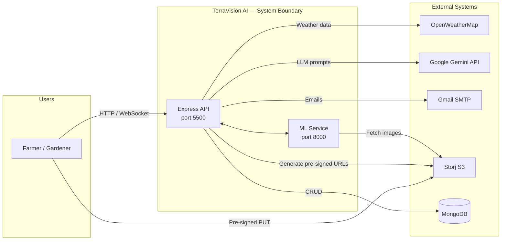
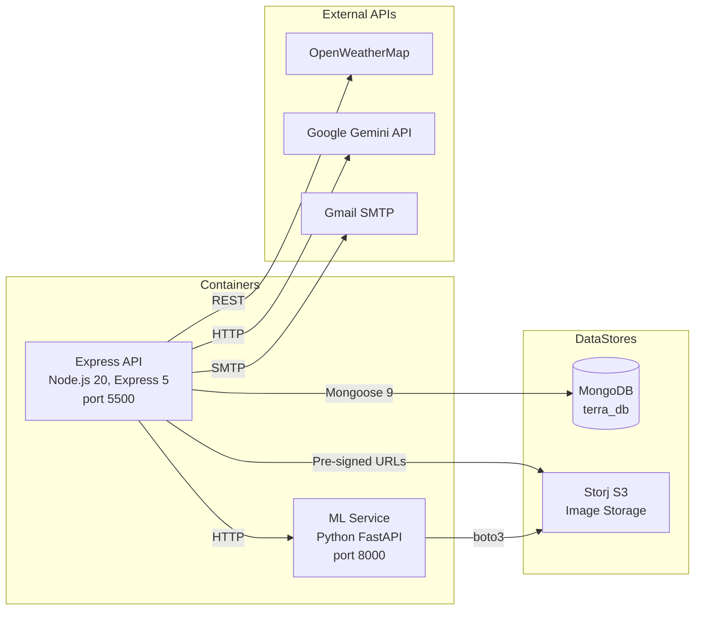
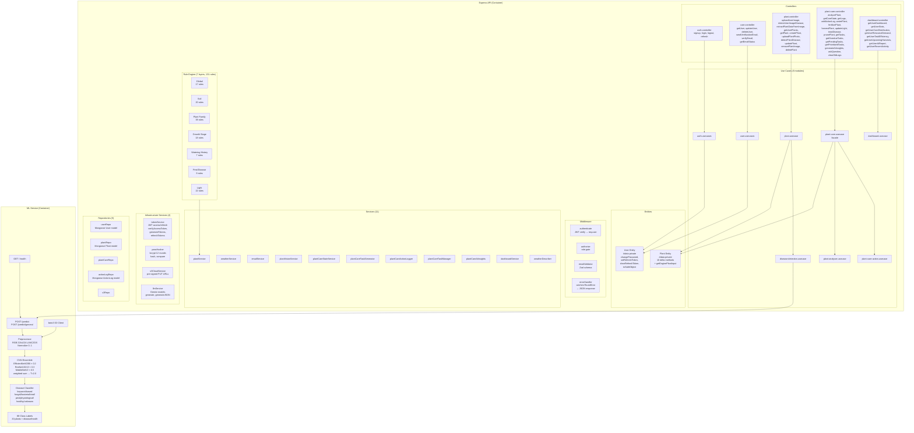
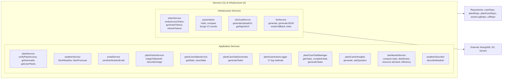
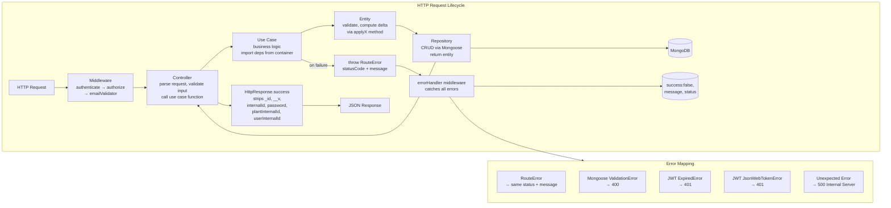

# 3. C4 Architecture Model

## Level 1 — System Context



## Level 2 — Container Diagram



## Level 3 — Component Diagram

### High-Level Structure



### Auth Use Case Detail

```mermaid
flowchart LR
    subgraph AuthUC["auth.usecases.js"]
        direction TB
        signup[signup\n(name,email,password,location)\n→ (user, tokens)]
        login[login\n(email,password)\n→ (user, tokens)]
        logout[logout\nuserUUID\n→ message]
        refresh[refresh\nrefreshToken\n→ (accessToken, refreshToken)]

        signup --> UserRepo
        login --> UserRepo
        logout --> UserRepo
        refresh --> UserRepo

        signup --> PassHash
        login --> PassHash

        signup --> TokenSvc
        login --> TokenSvc
        refresh --> TokenSvc

        login -->|409 if exists| Err409[RouteError 409]
        login -->|404 not found| Err404[RouteError 404]
        login -->|401 wrong password| Err401[RouteError 401]
    end

    subgraph Dependencies
        UserRepo[userRepo]
        PassHash[passHasher\nbcrypt 12]
        TokenSvc[tokenService\nJWT]
    end
```

### User Use Case Detail

```mermaid
flowchart LR
    subgraph UserUC["user.usecases.js"]
        direction TB
        getUser[getUser\nuuid, user\n→ User safe object]
        updateUser[updateUser\nuuid, data, user\n→ Updated user]
        deleteUser[deleteUser\nuuid, user\n→ void]
        sendVerification[sendVerificationEmail\nuuid\n→ message]
        verifyEmail[verifyEmail\ntoken\n→ message]
        getEmailStatus[getEmailStatus\nuuid\n→ (email, isVerified)]

        getUser --> URepo[userRepo]
        updateUser --> URepo
        deleteUser --> URepo
        sendVerification --> URepo
        verifyEmail --> URepo
        getEmailStatus --> URepo

        sendVerification --> EmailSvc[emailService]
    end
```

### Plant Use Case Detail

```mermaid
flowchart LR
    subgraph PlantUC["plant.usecase.js"]
        direction TB
        getUserPlants[getUserPlants\nuser\n→ plants]
        getPlant[getPlant\nplantUUID, user\n→ Plant]
        createPlant[createPlant\ndata, user\n→ Plant]
        updatePlant[updatePlant\nplantUUID, user, updateData\n→ Plant]
        deletePlant[deletePlant\nplantUUID, user\n→ void]
        uploadPhoto[uploadPlantPhoto\nplantUUID, user, fileName, fileType\n→ (uploadUrl, key)]
        detectDisease[detectPlantDisease\nplantUUID, user, key\n→ (disease, diseaseHistory)]
        removeImage[removePlantImage\nplantUUID, user, key\n→ void]
        extractData[extractPlantDataFromImage\nkey\n→ extracted plant data]
        detectUserImg[detectUserImageDisease\nkey, user\n→ simplified disease result]
        uploadUserImg[uploadUserImage\nuser, fileName, fileType\n→ (uploadUrl, key)]
    end

    subgraph PlantDeps["Dependencies"]
        URepo[userRepo]
        PRepo[plantRepo]
        LLMSvc[llmService]
        S3Svc[s3CloudService]
        Logger[plantCareActionLogger]
        ActionRepo[actionLogRepo]
        CareState[plantCareStateService]
        Vision[plantVisionService]
        PSvc[plantService]
    end

    getUserPlants --> URepo
    getPlant --> PSvc
    createPlant --> LLMSvc
    createPlant --> PRepo
    uploadPhoto --> S3Svc
    detectDisease --> PSvc
    detectDisease -->|HTTP| ML[ML Service /predict]
    deletePlant --> PRepo
    deletePlant --> ActionRepo
    deletePlant --> S3Svc
    extractData --> LLMSvc
    detectUserImg --> Vision
    getUserPlants --> PRepo
    updatePlant --> PSvc
    updatePlant --> PRepo
    removeImage --> PSvc
    removeImage --> S3Svc
```

### Plant Care Use Case Detail (Facade)

```mermaid
flowchart LR
    subgraph PlantCareUC["plant-care.usecase.js (facade)"]
        direction TB
        getCareState[getCareState\nplantUUID\n→ care state]
        getLogs[getLogs\nplantUUID, (type, page, limit, last)\n→ logs]
        addActionLog[addActionLog\nplantUUID, user, (actionType, desc, metadata)\n→ void]
        clearOldLogs[clearOldLogs\nplantUUID, before\n→ result]
        getTasks[getTasks\nplantUUID, page, limit\n→ tasks]
        getOverdueTasks[getOverdueTasks\nplantUUID\n→ tasks]
        getPendingTasks[getPendingTasks\nplantUUID\n→ tasks]
        getPrioritized[getPrioritizedTasks\nplantUUID\n→ tasks]
        generateInsights[generateAiInsights\nplantUUID, user\n→ insights]
        askQuestion[askQuestion\nplantUUID, question\n→ answer]
    end

    subgraph PCDeps["Dependencies"]
        URepo[userRepo]
        PSvc[plantService]
        CareSvc[plantCareStateService]
        Logger[plantCareActionLogger]
        TaskMgr[plantTaskCareManager]
        AI[plantCareAiInsights]
    end

    getCareState --> CareSvc
    getLogs --> Logger
    addActionLog --> Logger
    clearOldLogs --> Logger
    getTasks --> TaskMgr
    getOverdueTasks --> TaskMgr
    getPendingTasks --> TaskMgr
    getPrioritized --> TaskMgr
    generateInsights --> AI
    generateInsights --> PSvc
    askQuestion --> AI
    askQuestion --> PSvc
```

### Plant Care Action Use Case Detail (Pipeline)

```mermaid
flowchart LR
    subgraph ActionUC["plant-care-action.usecase.js"]
        direction TB
        subgraph EntryPoints
            waterPlant[waterPlant\nplantUUID, user]
            fertilizePlant[fertilizePlant\nplantUUID, user]
            harvestPlant[harvestPlant\nplantUUID, user]
            updateLight[updateLight\nplantUUID, user, lightCondition]
            treatDisease[treatDisease\nplantUUID, user]
            prunePlant[prunePlant\nplantUUID, user]
        end

        subgraph Pipeline["Core Pipeline (performAction)"]
            A[verifyAccess\nplantService.verifyPlantAccess]
            B[Entity Delta\nplant.applyWatering / applyFertilizing\n/ applyPruning / applyDiseaseTreatment\n/ applyHarvest / applyTaskAction]
            C[Repo Update\nplantRepo.updateByUUID]
            D[Complete Task\nplantTaskCareManager.completeTask]
            E[Log Action\nplantCareActionLogger.logAction]
            F[Re-analyze\nplantAnalyser.analyzeAndSavePlant]
            G[Check Optimal\ncareStateService]
            H[Generate Tasks\ntaskCareManager.generateTasks]
            I[AI Insights\nplantCareAiInsights.generate]
            J[Return\n(status, aiInsights, activeTasks)]
        end
    end

    subgraph ActionDeps["Dependencies"]
        URepo[userRepo]
        PRepo[plantRepo]
        CareSvc[plantCareStateService]
        TaskMgr[plantTaskCareManager]
        AI[plantCareAiInsights]
        Logger[plantCareActionLogger]
        PSvc[plantService]
    end

    waterPlant --> A
    fertilizePlant --> A
    harvestPlant --> A
    updateLight --> A
    treatDisease --> A
    prunePlant --> A

    A --> A_Psvc[→ plantService.verifyPlantAccess]
    B --> B_Ent[→ Plant Entity delta]
    C --> C_Repo[→ plantRepo.updateByUUID]
    D --> D_Mgr[→ taskCareManager]
    E --> E_Log[→ actionLogger]
    F --> F_Analyse[→ plantAnalyser]
    G --> G_Care[→ careStateService]
    H --> H_Gen[→ taskCareManager.generateTasks]
    I --> I_AI[→ plantCareAiInsights.generate]
    J --> J_Ret[→ HTTP response]

    A --> PSvc
    B --> PRepo
    E --> Logger
    F --> CareSvc
    H --> TaskMgr
    I --> AI
```

### Plant Analyser Use Case Detail

```mermaid
flowchart LR
    subgraph AnalyserUC["plant-analyser.usecase.js"]
        direction TB
        analyze[analyzeAndSavePlant\nplantUUID, user\n→ (status, activeTasks, scores)]

        analyze --> A1[Fetch user + plant\nuserRepo + plantService]
        analyze --> A2[Get weather\nweatherService]
        analyze --> A3[Describe weather\nweatherDescriber]
        analyze --> A4[Evaluate engine\nevaluate(weather, plant)\n→ waterScore, fertilizerScore,\npestRiskScore, lightScore]
        analyze --> A5[Save care state\nplantCareStateService]
        analyze --> A6[Log analysis\nplantCareActionLogger]
        analyze --> A7[Generate tasks\nplantCareTaskGenerator]
    end

    subgraph ADeps["Dependencies"]
        URepo[userRepo]
        PSvc[plantService]
        WeatherSvc[weatherService]
        WeatherDesc[weatherDescriber]
        Engine[Rule Engine\nevaluate()]
        CareSvc[plantCareStateService]
        Logger[plantCareActionLogger]
        TaskGen[plantCareTaskGenerator]
    end

    A1 --> URepo
    A1 --> PSvc
    A2 --> WeatherSvc
    A3 --> WeatherDesc
    A4 --> Engine
    A5 --> CareSvc
    A6 --> Logger
    A7 --> TaskGen
```

### Disease Detection Use Case Detail

```mermaid
flowchart LR
    subgraph DiseaseUC["disease-detection.usecase.js"]
        direction TB
        detectUserImg[detectUserImageDisease\n(key, userId)\n→ (disease, plant, confidence,\ndisease_type, topPredictions)]
        detectAndSave[detectAndSaveDisease\n(key, userId, plantId, expectedPlant)\n→ (disease, diseaseHistory)]

        detectUserImg --> S3[s3CloudService\ngetSignedUrl]
        detectUserImg --> ML[axios → ML Service\nPOST /predict]
        detectUserImg --> Fallback[Fallback\nany failure → healthy\nconfidence 1.0]

        detectAndSave --> PRepo[plantRepo\nfindByUUID]
        detectAndSave --> S3
        detectAndSave --> ML
        detectAndSave --> F2[Fallback\nplant not found → 404\nML failure → healthy]
    end

    ML --> MLService[ML Service Container\n/Predict endpoint]
```

### Dashboard Use Case Detail

```mermaid
flowchart LR
    subgraph DashUC["dashboard.usecase.js"]
        direction TB
        getDashboard[getUserDashboard\nuser\n→ (stats, aiReport, recentActivity)]
        getStats[getUserStats\nuser\n→ plant stats]
        getCareDist[getUserCareDistribution\nuser\n→ care distribution]
        getResourceDemand[getUserResourceDemand\nuser\n→ resource demand]
        getTaskEfficiency[getUserTaskEfficiency\nuser\n→ task efficiency]
        getUpcomingHarvests[getUserUpcomingHarvests\nuser, last\n→ harvests]
        getAiReport[getUserAiReport\nuser\n→ aiReport]
        getRecentActivity[getUserRecentActivity\nuser, last\n→ logs]
    end

    subgraph DDeps["Dependencies"]
        URepo[userRepo]
        DashSvc[dashboardService]
        AI[plantCareAiInsights]
        ActionRepo[actionLogRepo]
    end

    getDashboard --> DashSvc
    getDashboard --> AI
    getDashboard --> ActionRepo
    getStats --> DashSvc
    getCareDist --> DashSvc
    getResourceDemand --> DashSvc
    getTaskEfficiency --> DashSvc
    getUpcomingHarvests --> DashSvc
    getAiReport --> AI
    getRecentActivity --> ActionRepo

    DashSvc --> URepo
```

### Entity Detail

```mermaid
flowchart LR
    subgraph PlantEntity["Plant Entity"]
        direction TB
        PrivateData["#data\n( uuid, internalId, userInternalId, name,\n  commonName, category, family, growthStage,\n  soil, watering, disease, diseaseHistory,\n  stress, cdn, hasDisease )"]
        Getters["Getters\nfor all fields"]
        DeltaMethods["Delta Methods (return MongoDB dot-notation)"]
        AW[applyWatering\nhoursSinceLastWatering]
        AF[applyFertilizing]
        AP[applyPruning]
        ADT[applyDiseaseTreatment]
        AH[applyHarvest]
        ATA[applyTaskAction\ntype]
        AI[addImage\nfileName]
        RI[removeImage\nfileName]
        SBP[setBasePath\npath]
        RDD[recordDiseaseDetection\nprediction object]
        EGI[getEnginePlantInput\n→ (category, family, growthStage,\n  soilType, soilMoisture, hoursSinceLastWatering,\n  hasDisease, diseaseType, diseaseSeverity,\n  lightCondition)]
    end

    subgraph UserEntity["User Entity"]
        direction TB
        UPrivate["#data\n( uuid, internalId, email, password,\n  role, isVerified, refreshToken, location )"]
        UGetters["Getters\nfor all fields"]
        UMutate["Mutation Methods"]
        CP[changePassword\nnewPasswordHash → bcrypt]
        SRT[setRefreshToken\ntokenHash]
        CRT[clearRefreshToken]
        TSO[toSafeObject\nstrips password,\nrefreshToken, internalId]
    end
```

### Services Detail



### Middleware Detail

```mermaid
flowchart LR
    subgraph MiddlewareChain["Middleware Pipeline"]
        direction LR
        Req[HTTP Request] --> Auth[authenticate\nJWT Bearer token\nverifyAccessToken\n→ req.user = (uuid, email, role)]
        Auth --> Role[authorize\n...roles\n403 if not authorized]
        Role --> EmailVal[emailValidator\nZod schema\n400 if invalid]
        EmailVal --> Route[Route Handler]
        Route -->|on error| Err[errorHandler\ncatches RouteError\n→ (success:false, message, status)\ncatches Mongoose/JWT errors\n→ 400/401/500]
    end
```

### ML Service Component Detail

```mermaid
flowchart LR
    subgraph MLContainer["ML Service (FastAPI, port 8000)"]
        direction TB

        subgraph Endpoints
            Health[GET /\n→ status: healthy]
            Predict[POST /predict\nmultipart image\n→ (disease, confidence,\n  disease_type, plant,\n  top_predictions)]
            PredictGeneral[POST /predict/general\nmultipart image\n→ (disease, confidence,\n  disease_type, plant,\n  top_predictions)]
        end

        subgraph Pipeline["Inference Pipeline"]
            Load[Load image\nfrom upload / S3]
            Preprocess[Preprocess\nRGB conversion\n224×224 LANCZOS resize\nNormalize pixel 0..1]
            Ensemble[CNN Ensemble\nWeighted Average]
            E0[EfficientNetV2B0\nweight 0.2]
            R101[ResNet101V2\nweight 0.3]
            MN[MobileNetV2\nweight 0.5]
            WeightedSum[weighted_sum\n+ temperature scaling T=2.0]
            Classify[Disease Classifier\nkeyword matching\n→ fungal / bacterial / viral /\npest / physiological /\nhealthy / unknown]
        end

        S3[boto3 S3 Client\nfetch images from Storj]
        Labels[86 crop-disease classes\n+ 2 general = 88 labels]
    end

    Health --> Predict
    Predict --> Load
    PredictGeneral --> Load
    Load --> Preprocess
    Preprocess --> E0
    Preprocess --> R101
    Preprocess --> MN
    E0 --> WeightedSum
    R101 --> WeightedSum
    MN --> WeightedSum
    WeightedSum --> Classify
    Classify --> Labels
    S3 --> Load
```

### DI Container Wiring

```mermaid
flowchart LR
    subgraph Container["shared/container.js"]
        direction TB

        subgraph Repos_["Repositories"]
            UR[userRepo\n← User model]
            PR[plantRepo\n← Plant model]
            PCR[plantCareRepo]
            ALR[actionLogRepo\n← ActionLog model]
            S3R[s3Repo]
        end

        subgraph Services_["Services"]
            PS[plantService\n← plantRepo, s3CloudService]
            WS[weatherService\n← axios, config]
            ES[emailService\n← nodemailer, config]
            PVS[plantVisionService\n← llmService]
            CSS[plantCareStateService\n← plantCareRepo]
            TG[plantCareTaskGenerator\n← llmService, plantCareStateService]
            AL[plantCareActionLogger\n← actionLogRepo]
            TM[plantCareTaskManager\n← taskGenerator, actionLogRepo]
            AI[plantCareAiInsights\n← llmService, weatherService,\nplantCareStateService]
            DS[dashboardService\n← plantRepo, actionLogRepo]
            WD[weatherDescriber\n← llmService]
        end

        subgraph Infra_["Infrastructure Services"]
            TS[tokenService\n← jwt, config]
            PH[passHasher\n← bcrypt]
            S3C[s3CloudService\n← @aws-sdk/s3, config]
            LLM[llmService\n← @google/generative-ai, config]
        end

        subgraph Engine_["Rule Engine"]
            Eval[evaluate\n← rules JSON files]
        end

        PS --> PR
        PS --> S3C
        PVS --> LLM
        TG --> LLM
        TG --> CSS
        AL --> ALR
        TM --> TG
        TM --> AL
        AI --> LLM
        AI --> WS
        AI --> CSS
        DS --> PR
        DS --> ALR
        WD --> LLM

        Eval --> sharedRules[shared/rules/*.json]
    end

    UseCases["Use Cases import from container.js"] --> Container
    Controllers["Controllers import use cases only"] --> UseCases
```



## Level 4 — Code Level

### DI Container Pattern

`shared/container.js` creates all repos first, then services (which depend on repos and infra services), then infrastructure services. Use cases import from container directly:

```js
import { userRepo, plantRepo, plantService, llmService, s3CloudService, ... } from "../shared/container.js";
```

Controllers never import from container — only from their use case module.

### Dual-Key Pattern

Every entity (Plant, User) has `uuid` (public-facing string, in API/JWT) + `internalId` (numeric `Date.now()`, FK target).

| Relationship | FK Field | Source |
|---|---|---|
| Plant → User | `plant.userInternalId` → `user.internalId` | Plant schema |
| ActionLog → Plant | `actionLog.plantInternalId` → `plant.internalId` | ActionLog schema |
| ActionLog → User | `actionLog.userInternalId` → `user.internalId` | ActionLog schema |

Resolution:
```js
const userInternalId = user.internalId || (await userRepo.findByUUID(user.uuid)).internalId;
const plantInternalId = await plantService.getInternalId(plantUUID);
```

### Entity Delta Pattern

`Plant#data` is private (`#data`). 10 methods return MongoDB dot-notation delta objects — never mutate Plant data directly:

| Method | Returns | Purpose |
|--------|---------|---------|
| `applyWatering(hoursSinceLastWatering)` | `{ "watering.hoursSinceLastWatering": value }` | Resets watering timer |
| `applyFertilizing()` | `{ "soil.lastFertilized": Date }` | Records fertilization |
| `applyPruning()` | `{ "soil.lastPruned": Date }` | Records pruning |
| `applyDiseaseTreatment()` | `{ "disease.name": "healthy", "disease.confidence": 0, "hasDisease": false }` | Clears disease |
| `applyHarvest()` | `{ "growthStage": "mature" }` | Advances growth |
| `applyTaskAction(type)` | Varies by type | Generic task action |
| `addImage(fileName)` | `{ $push: { "cdn.images": fileName } }` | Adds image |
| `removeImage(fileName)` | `{ $pull: { "cdn.images": fileName } }` | Removes image |
| `setBasePath(path)` | `{ "cdn.basePath": path }` | Sets S3 path |
| `recordDiseaseDetection(pred)` | `{ "disease": pred, $push: diseaseHistory }` | Records detection |

### Logger Contract

`PlantCareActionLogger` constructor takes `actionLogRepo`. All 17 log methods follow:

```
logMethod(plantUUID, userUUID, userInternalId, plantInternalId, description, metadata?)
```

Use cases resolve `internalId` values before calling logger methods.

### Function Reference — Use Cases

#### auth.usecases.js

| Function | Args | Returns | Throws |
|----------|------|---------|--------|
| signup | `{name, email, password, location}` | `{user, tokens}` | 409 if email exists |
| login | `{email, password}` | `{user, tokens}` | 404 if user not found, 401 if wrong password |
| logout | `userUUID` | `{message}` | 404 if user not found |
| refresh | `refreshToken` | `{accessToken, refreshToken}` | 401 if invalid/mismatched |

#### user.usecases.js

| Function | Args | Returns | Throws |
|----------|------|---------|--------|
| getUser | `uuid, user` | User safe object | 403 if not self/admin |
| updateUser | `uuid, data, user` | Updated user | 403 if not self/admin |
| deleteUser | `uuid, user` | void | 403 if not self/admin |
| sendVerificationEmail | `uuid` | `{message}` | 404 if user not found |
| verifyEmail | `token` | `{message}` | null if invalid token |
| getEmailStatus | `uuid` | `{email, isVerified}` | null if not found |

#### plant.usecase.js

| Function | Args | Returns | Throws |
|----------|------|---------|--------|
| getUserPlants | `user` | Plant[] | — |
| getPlant | `plantUUID, user` | Plant | 404/403 from verifyPlantAccess |
| createPlant | `data, user` | Plant | — |
| updatePlant | `plantUUID, user, updateData` | Plant | 404/403 |
| deletePlant | `plantUUID, user` | void | 404/403 |
| uploadPlantPhoto | `plantUUID, user, fileName, fileType` | `{uploadUrl, key}` | 404/403 |
| detectPlantDisease | `plantUUID, user, key` | `{disease, diseaseHistory}` | 404/403 |
| removePlantImage | `plantUUID, user, key` | void | 404/403 |
| extractPlantDataFromImage | `key` | extracted plant data | — |
| detectUserImageDisease | `key, user` | simplified disease result | — |
| uploadUserImage | `user, fileName, fileType` | `{uploadUrl, key}` | — |

#### plant-care.usecase.js (facade)

| Function | Args | Returns | Throws |
|----------|------|---------|--------|
| getCareState | `plantUUID` | care state | 404 |
| getLogs | `plantUUID, {type,page,limit,last}` | Log[] | — |
| addActionLog | `plantUUID, user, {actionType, description, metadata}` | void | 400 |
| clearOldLogs | `plantUUID, before` | result | 404 |
| getTasks | `plantUUID, page, limit` | Task[] (unwrapped) | — |
| getOverdueTasks | `plantUUID` | Task[] | — |
| getPendingTasks | `plantUUID` | Task[] | — |
| getPrioritizedTasks | `plantUUID` | Task[] | — |
| generateAiInsights | `plantUUID, user` | insights | 404 |
| askQuestion | `plantUUID, question` | answer | 400, 404 |

#### plant-care-action.usecase.js

| Function | Args | Returns | Throws |
|----------|------|---------|--------|
| waterPlant | `plantUUID, user` | `{status, aiInsights, activeTasks}` | 403/404 |
| fertilizePlant | `plantUUID, user` | `{status, aiInsights, activeTasks}` | 403/404 |
| harvestPlant | `plantUUID, user` | `{status, aiInsights, activeTasks}` | 403/404 |
| updateLight | `plantUUID, user, lightCondition` | `{status, aiInsights, activeTasks}` | 403/404 |
| treatDisease | `plantUUID, user` | `{status, aiInsights, activeTasks}` | 403/404 |
| prunePlant | `plantUUID, user` | `{status, aiInsights, activeTasks}` | 403/404 |

#### plant-analyser.usecase.js

| Function | Args | Returns | Throws |
|----------|------|---------|--------|
| analyzeAndSavePlant | `plantUUID, user` | `{status, activeTasks, scores}` | — (weather failure non-fatal) |

#### disease-detection.usecase.js

| Function | Args | Returns | Throws |
|----------|------|---------|--------|
| detectUserImageDisease | `{key, userId}` | `{disease, plant, confidence, disease_type, topPredictions}` | — (ML failure → fallback healthy) |
| detectAndSaveDisease | `{key, userId, plantId, expectedPlant}` | `{disease, diseaseHistory}` | 404 if plant not found, else healthy fallback |

#### dashboard.usecase.js

| Function | Args | Returns | Throws |
|----------|------|---------|--------|
| getUserDashboard | `user` | `{stats, aiReport, recentActivity}` | — |
| getUserStats | `user` | plant stats | — |
| getUserCareDistribution | `user` | care distribution | — |
| getUserResourceDemand | `user` | resource demand | — |
| getUserTaskEfficiency | `user` | task efficiency | — |
| getUserUpcomingHarvests | `user, last` | harvests | — |
| getUserAiReport | `user` | `{aiReport}` | — |
| getUserRecentActivity | `user, last` | `{logs}` | — |

### Request Lifecycle



### ML Service Inference Pipeline

```mermaid
flowchart LR
    subgraph Inference["Inference Flow"]
        Input[Client sends image\nmultipart/form-data] --> EP[FastAPI Endpoint\nPOST /predict\nor /predict/general]
        EP --> Load[Load image\nfrom upload or S3]
        Load --> Convert[Convert to RGB\ndrop alpha channel]
        Convert --> Resize[Resize to 224×224\nLANCZOS interpolation]
        Resize --> Normalize[Normalize pixel values\nto 0..1 float32]
        Normalize --> Ensemble[CNN Ensemble Inference]
        Ensemble --> W1[EfficientNetV2B0\nweight 0.2]
        Ensemble --> W2[ResNet101V2\nweight 0.3]
        Ensemble --> W3[MobileNetV2\nweight 0.5]
        W1 --> Sum[Weighted Sum]
        W2 --> Sum
        W3 --> Sum
        Sum --> Temp[Temperature Scaling\nT = 2.0]
        Temp --> Argmax[Argmax → class index]
        Argmax --> Classify[Classify disease type\nkeyword matching]
        Classify --> Result[(disease, confidence,\ndisease_type, plant,\ntop_predictions)]
        Result --> Response[JSON Response]
    end

    subgraph Fallback["Fallback Logic"]
        F1[Any exception during\ninference or download]
        F1 --> F2[Return default:\ndisease = \"healthy\"\nconfidence = 1.0\nplant = \"Unknown\"\ndisease_type = \"healthy\"]
    end

    EP --> F1
```
