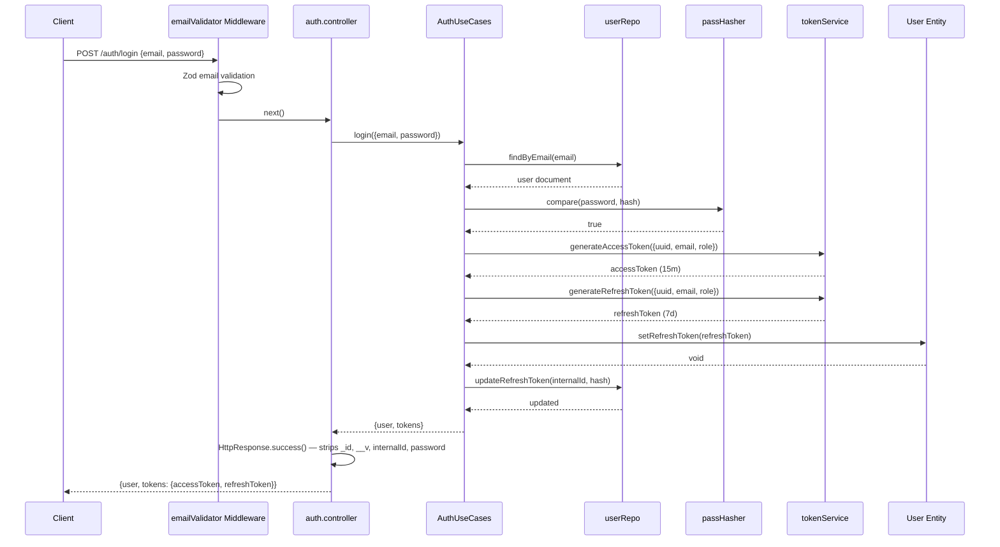
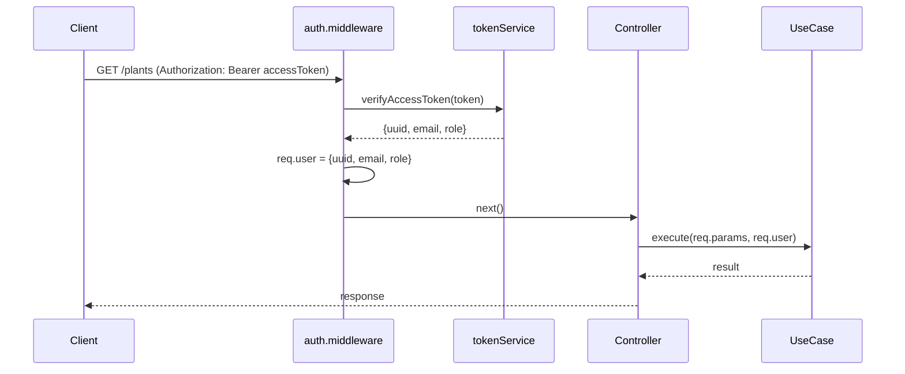
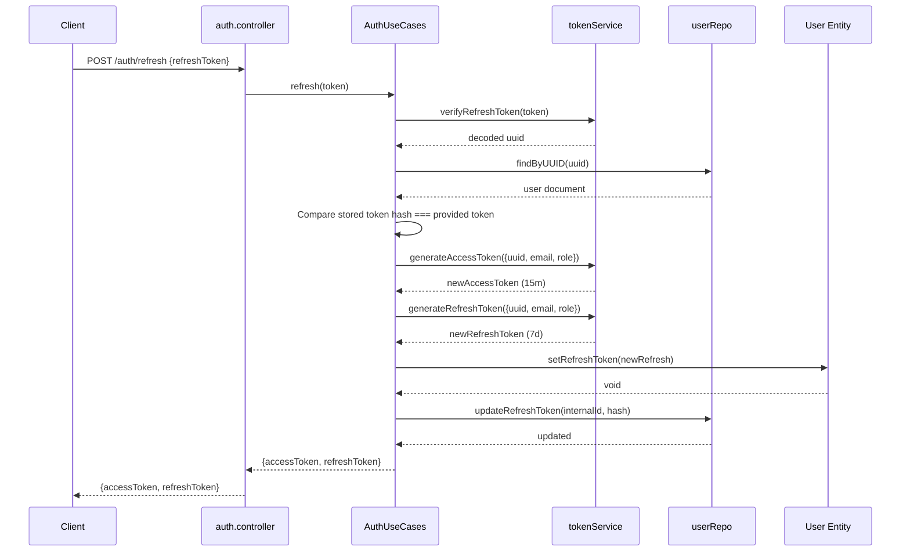
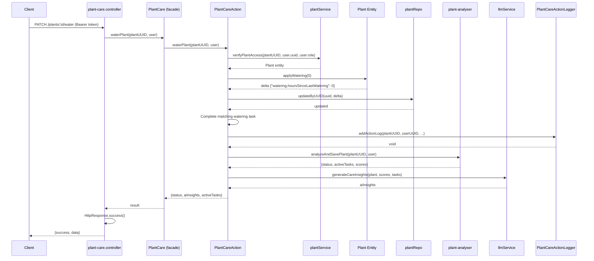
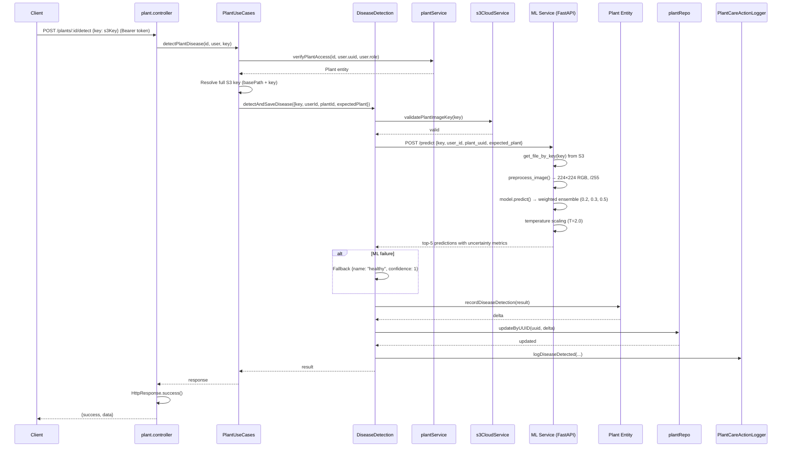
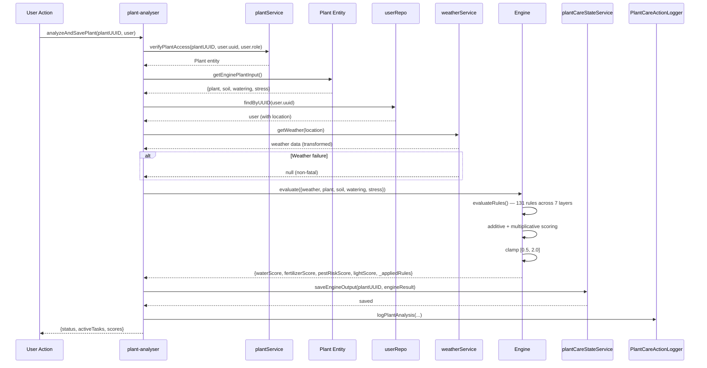
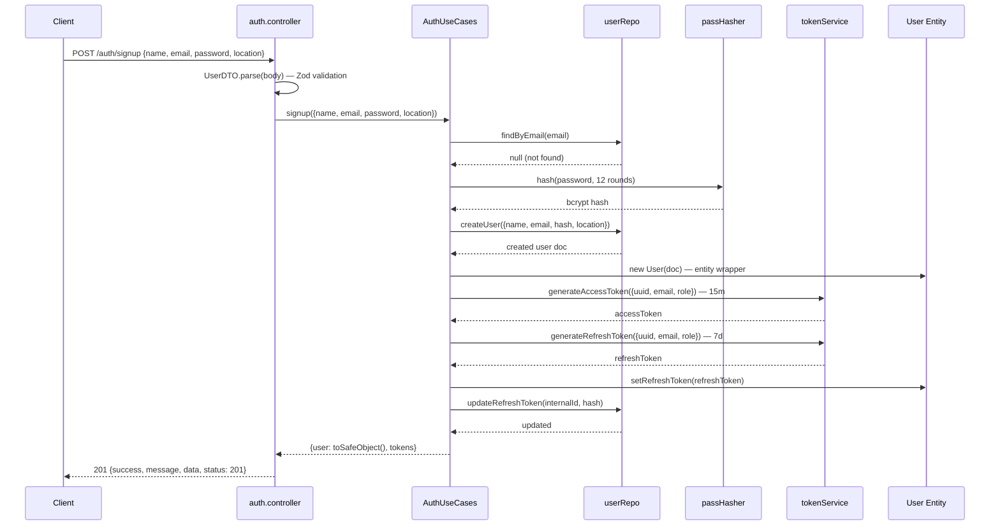
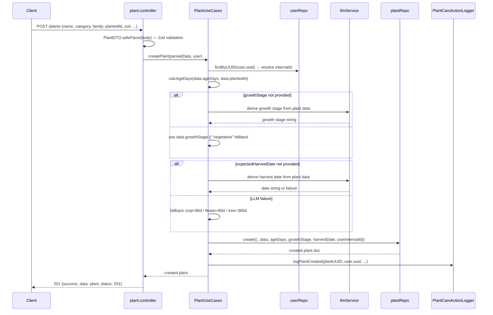
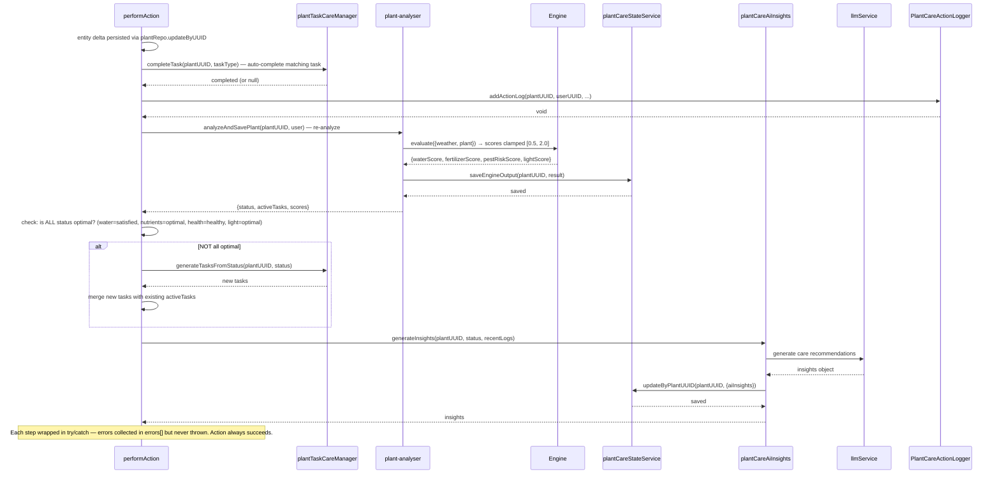
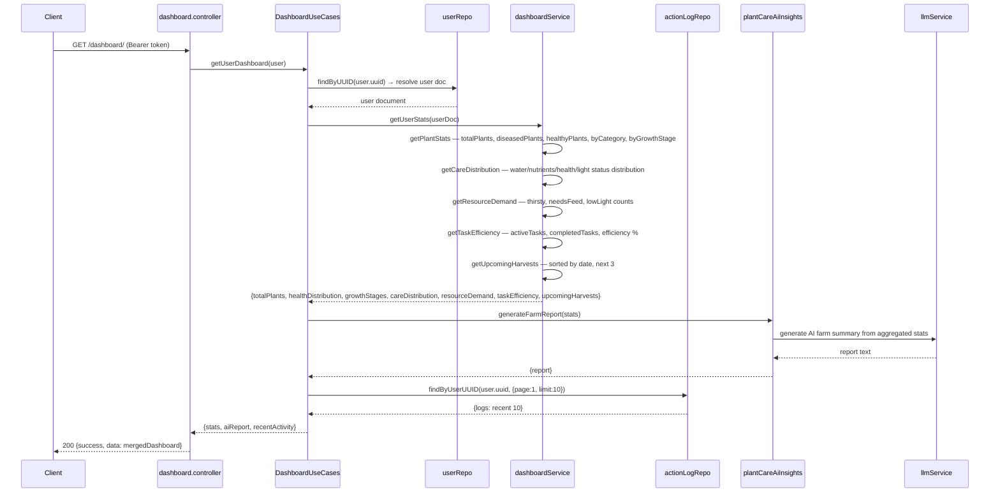

# 4. UML Diagrams

## 4.1 Use Case Diagram

```mermaid
flowchart TD
  User((User))
  Admin((Admin))
  ML_Service((ML Service))
  External_APIs((External APIs))

  subgraph Auth["Auth Module — /api/v1/auth"]
    A1[Register account]
    A2[Login]
    A3[Logout]
    A4[Refresh token]
    A5[Send verification email]
    A6[Verify email]
  end

  subgraph User_Module["User Module — /api/v1/users"]
    U1[View profile]
    U2[Update profile]
    U3[Delete account]
    U4[Request email verification]
    U5[Verify email token]
    U6[Check email status]
    U7[Admin views any user]
  end

  subgraph Plant_Module["Plant Module — /api/v1/plants"]
    P1[List own plants]
    P2[View single plant]
    P3[Create plant]
    P4[Update plant]
    P5[Delete plant]
    P6[Upload plant image via S3 pre-signed URL]
    P7[Extract plant data from image]
    P8[Detect disease on plant image]
    P9[Detect disease on user image]
    P10[Remove plant image]
    P11[Admin accesses any plant]
  end

  subgraph Plant_Care["Plant Care Module — /api/v1/plants/:id/*"]
    C1[Analyze plant]
    C2[View care state]
    C3[View action logs]
    C4[Add action log]
    C5[Clear old logs]
    C6[Water plant]
    C7[Fertilize plant]
    C8[Harvest plant]
    C9[Adjust light conditions]
    C10[Treat disease]
    C11[Prune plant]
    C12[View tasks]
    C13[View overdue tasks]
    C14[View pending tasks]
    C15[View prioritized tasks]
    C16[Generate AI insights]
    C17[Ask question about plant]
  end

  subgraph Dashboard["Dashboard Module — /api/v1/dashboard"]
    D1[View dashboard summary]
    D2[View plant statistics]
    D3[View care distribution]
    D4[View resource demand]
    D5[View task efficiency]
    D6[View upcoming harvests]
    D7[View AI farm report]
    D8[View recent activity]
  end

  subgraph ML_Service_Sub["ML Service — port 8000"]
    ML_HEALTH[Health check]
    ML_PREDICT[Predict disease<br/>fetch image from S3<br/>preprocess → 224×224 RGB<br/>ensemble inference weighted [0.2, 0.3, 0.5]<br/>temperature scaling T=2.0<br/>classify disease type]
  end

  User --> A1
  User --> A2
  User --> A3
  User --> A4
  User --> U1
  User --> U2
  User --> U3
  User --> U4
  User --> U6
  User --> P1
  User --> P2
  User --> P3
  User --> P4
  User --> P5
  User --> P6
  User --> P7
  User --> P8
  User --> P9
  User --> P10
  User --> C1
  User --> C2
  User --> C3
  User --> C4
  User --> C5
  User --> C6
  User --> C7
  User --> C8
  User --> C9
  User --> C10
  User --> C11
  User --> C12
  User --> C13
  User --> C14
  User --> C15
  User --> C16
  User --> C17
  User --> D1
  User --> D2
  User --> D3
  User --> D4
  User --> D5
  User --> D6
  User --> D7
  User --> D8

  Admin --> User
  Admin -.->|access any| U7
  Admin -.->|access any| P11

  A5 -.->|send email| External_APIs
  U5 -.->|verify| User_Module

  P3 -.->|<<extend>> LLM derivation| P3
  P7 -.->|<<uses>> Gemini| External_APIs
  P8 -.->|<<include>>| ML_PREDICT
  P9 -.->|<<include>>| ML_PREDICT

  C16 -.->|<<uses>> Gemini| External_APIs
  C17 -.->|<<uses>> Gemini| External_APIs
  D7 -.->|<<uses>> Gemini| External_APIs

  ML_PREDICT -.->|fetch S3| External_APIs

  C1 -.->|Engine evaluation| C1
```

## 4.2 Sequence Diagrams

### 4.2.1 Auth Flow — Login



### 4.2.2 Protected Route Access



### 4.2.3 Token Refresh



### 4.2.4 Plant Care Action — Watering



### 4.2.5 Disease Detection



### 4.2.6 Plant Analysis / Engine Flow



### 4.2.7 User Signup



### 4.2.8 Plant Creation



### 4.2.9 Task Completion Pipeline (post-action)



### 4.2.10 Dashboard Aggregation



## 4.3 Activity Diagram — Plant Care Action Pipeline

```mermaid
flowchart TD
  START([Start]) --> VPA[1. verifyPlantAccess<br/>owner/admin gate]

  VPA --> EDM[2. Entity delta method<br/>applyWatering / applyFertilizing / etc]

  EDM --> T1{{try/catch boundary}}
  T1 --> UPD[3. plantRepo.updateByUUID<br/>uuid, delta]
  UPD --> T2{{try/catch boundary}}

  T2 --> CMT[4. Complete matching task<br/>in care state]
  CMT --> T3{{try/catch boundary}}

  T3 --> LOG[5. Log action via<br/>PlantCareActionLogger]
  LOG --> T4{{try/catch boundary}}

  T4 --> REA[6. Re-analyze:<br/>analyzeAndSavePlant]
  REA --> WEA[6a. Weather fetch<br/>optional — non-fatal]
  WEA --> ENG[6b. Engine evaluation<br/>7 layers, 131 rules]
  ENG --> CSS[6c. Save care state scores]
  CSS --> T5{{try/catch boundary}}

  T5 --> CHK{7. All statuses optimal?<br/>water=satisfied<br/>nutrients=optimal<br/>health=healthy<br/>light=optimal}

  CHK -- No --> GEN[8a. Generate new tasks<br/>from status]
  GEN --> MRG[8b. Merge with existing<br/>active tasks]
  MRG --> T6{{try/catch boundary}}

  CHK -- Yes --> SKIP[skip task generation]
  SKIP --> T6

  T6 --> AI[9. Generate AI insights<br/>via Gemini]
  AI --> PER[10. Persist insights<br/>to care state]
  PER --> RET[Return {status, aiInsights, activeTasks}]

  RET --> END([End])

  style T1 fill:#ffcccc,stroke:#cc0000
  style T2 fill:#ffcccc,stroke:#cc0000
  style T3 fill:#ffcccc,stroke:#cc0000
  style T4 fill:#ffcccc,stroke:#cc0000
  style T5 fill:#ffcccc,stroke:#cc0000
  style T6 fill:#ffcccc,stroke:#cc0000
```

## 4.4 Package Diagram — Module Dependencies

```mermaid
flowchart LR
  subgraph Auth_Module["Auth Module"]
    A_ROUTES[/api/v1/auth]
    A_CTRL[auth.controller]
    A_UC[auth.usecases]
  end

  subgraph User_Module["User Module"]
    U_ROUTES[/api/v1/users]
    U_CTRL[user.controller]
    U_UC[user.usecases]
  end

  subgraph Plant_Module["Plant Module"]
    P_ROUTES[/api/v1/plants]
    P_CTRL[plant.controller]
    P_UC[plant.usecase]
    P_DD[disease-detection.usecase]
  end

  subgraph Plant_Care_Module["Plant Care Module"]
    PC_ROUTES[/api/v1/plants/:id/*]
    PC_CTRL[plant-care.controller]
    PC_UC[plant-care.usecase]
    PCA_UC[plant-care-action.usecase]
    PA_UC[plant-analyser.usecase]
    PC_AI[plantCareAiInsights]
    PC_TM[plantTaskCareManager]
    PC_LOG[plantCareActionLogger]
    PC_CSS[plantCareStateService]
    PC_TG[plantCareTaskGenerator]
  end

  subgraph Dashboard_Module["Dashboard Module"]
    D_ROUTES[/api/v1/dashboard]
    D_CTRL[dashboard.controller]
    D_UC[dashboard.usecase]
    D_SVC[dashboardService]
  end

  subgraph Shared_Services["Shared Services"]
    UR[userRepo]
    PR[plantRepo]
    PCR[plantCareRepo]
    ALR[actionLogRepo]
    S3R[s3Repo]
    TS[tokenService]
    PH[passHasher]
    ES[emailService]
    PS[plantService]
    S3[s3CloudService]
    WS[weatherService]
    LLM[llmService]
    ENG[Engine]
  end

  subgraph External["External"]
    ML[ML Service<br/>FastAPI :8000]
    GEMINI[Gemini API]
    WEATHER[Weather API]
    SMTP[SMTP]
    S3_STORJ[S3 / Storj]
  end

  Auth_Module --> UR
  Auth_Module --> TS
  Auth_Module --> PH

  User_Module --> UR
  User_Module --> ES

  Plant_Module --> UR
  Plant_Module --> PR
  Plant_Module --> PS
  Plant_Module --> LLM
  Plant_Module --> S3
  Plant_Module --> P_DD

  Plant_Care_Module --> PS
  Plant_Care_Module --> PC_CSS
  Plant_Care_Module --> PC_TM
  Plant_Care_Module --> PC_AI
  Plant_Care_Module --> PC_LOG
  Plant_Care_Module --> WS
  Plant_Care_Module --> ENG
  PC_TG --> LLM
  PC_AI --> LLM

  Dashboard_Module --> D_SVC
  Dashboard_Module --> PC_AI
  Dashboard_Module --> ALR
  D_SVC --> PR
  D_SVC --> PCR

  P_DD -.->|HTTP POST /predict| ML
  ML -.->|fetch image| S3_STORJ
  P_UC -.->|generateResponse| GEMINI
  PC_AI -.->|generateResponse| GEMINI
  LLM -.->|API call| GEMINI
  WS -.->|API call| WEATHER
  ES -.->|send email| SMTP
  S3 -.->|pre-signed PUT| S3_STORJ
```

## 4.5 Class Diagram — Core Entities

```mermaid
classDiagram
  class User {
    +String uuid
    +Number internalId
    +String name
    +String email
    +String password (bcrypt hash, 12 rounds)
    +String role: user | admin
    +Boolean isVerified
    +String refreshToken
    +String emailToken
    +Object location: {city} XOR {coordinates: {lat, lon}}
    +Date createdAt
    +Date updatedAt
    +getPassword()
    +getRefreshToken()
    +setRefreshToken(token)
    +clearRefreshToken()
    +toSafeObject()
  }

  class Plant {
    +String uuid
    +Number internalId
    +Number userInternalId (FK → User.internalId)
    +String name
    +String commonName
    +String category: crop | tree | flower
    +String family: leafy_greens | fruiting_nightshade | succulent | root_crops | brassicas | legumes | herbs | tropical | citrus | vines | grasses | flowering_ornamentals
    +String growthStage: germination | seedling | vegetative | flowering | fruiting | mature
    +Date plantedAt
    +Date expectedHarvestDate
    +Object soil: {type, moisture, lastFertilized, lastPruned}
    +Object watering: {hoursSinceLastWatering}
    +Object disease (DiseaseSubSchema)
    +Array diseaseHistory (DiseaseSubSchema[])
    +Object stress: {diseaseType: bacterial|fungal|none, severity: high|medium|none}
    +Object cdn: {basePath, images[]}
    +Number ageDays
    +Boolean hasDisease (auto-calculated)
    +Date createdAt
    +Date updatedAt
    +getEnginePlantInput()
    +addImage(fileName)
    +removeImage(fileName)
    +setBasePath(basePath)
    +recordDiseaseDetection(prediction)
    +applyWatering(hoursSinceLastWatering)
    +applyFertilizing()
    +applyPruning()
    +applyDiseaseTreatment()
    +applyHarvest()
    +applyTaskAction(taskType)
  }

  class DiseaseSubSchema {
    +String name (default: "healthy")
    +Number confidence (default: 1)
    +Date detectedAt
  }

  class PlantCare {
    +String uuid
    +Number internalId
    +String plantUUID (FK → Plant.uuid)
    +Object status: StatusSubSchema {water, nutrients, health, light}
    +Object engineScores: EngineScoresSubSchema {waterScore, fertilizerScore, pestRiskScore, lightScore, appliedRules[]}
    +Array activeTasks (PlantTaskSubSchema[])
    +Array completedTasks (PlantTaskSubSchema[])
    +Object aiInsights: AiInsightsSubSchema {summary, recommendations[], generatedAt}
    +Date createdAt
    +Date updatedAt
  }

  class ActionLog {
    +String logId
    +String plantUUID (FK → Plant.uuid)
    +Number plantInternalId (FK → Plant.internalId)
    +String userUUID (FK → User.uuid)
    +Number userInternalId (FK → User.internalId)
    +String actionType: watered | fertilized | disease_scan | disease_detected | task_completed | task_added | task_updated | task_cancelled | light_changed | harvested | plant_analysis | plant_created | plant_updated | plant_deleted | image_uploaded | image_removed | plant_data_extracted | insight_generated
    +String description
    +Mixed metadata
    +Date createdAt
  }

  User "1" --> "many" Plant : userInternalId
  Plant "1" --> "1" PlantCare : plantUUID
  Plant "many" --> "many" ActionLog : plantUUID
  User "1" --> "many" ActionLog : userUUID
  Plant "1" --> DiseaseSubSchema : disease (embedded)
  Plant "1" --> "many" DiseaseSubSchema : diseaseHistory (embedded)
```
