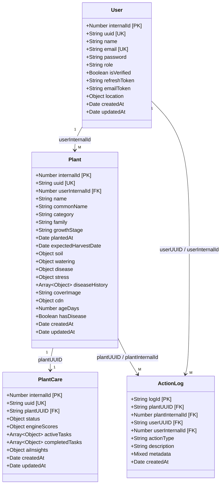

# 6. Data Architecture

**Database**: MongoDB — name `terra_db` at `mongodb://127.0.0.1:27017/terra_db`
**ODM**: Mongoose 9.6.2 (no explicit connection options — Mongoose 9 defaults)
**Module**: `Backend/model/`

---

## 6.1 User Collection

| Field | Type | Required | Unique | Default | Notes |
|-------|------|----------|--------|---------|-------|
| internalId | Number | No | Yes | `Date.now()` | Internal FK target |
| uuid | String | No | Yes | `uuidv4()` | Public-facing ID |
| name | String | Yes | No | — | |
| email | String | Yes | Yes | — | Lowercased before save |
| password | String | Yes | No | — | bcrypt hash (12 rounds) |
| role | String | No | No | `"user"` | Enum: `"user"`, `"admin"` |
| isVerified | Boolean | No | No | `false` | Email verification flag |
| refreshToken | String | No | No | `null` | Stored as plain JWT string |
| emailToken | String | No | No | `null` | `crypto.randomBytes(32)` hex |
| location.city | String | No | No | — | XOR with coordinates |
| location.coordinates.lat | Number | No | No | — | -90 to 90 |
| location.coordinates.lon | Number | No | No | — | -180 to 180 |
| createdAt | Date | No | No | `Date.now` | |
| updatedAt | Date | No | No | `Date.now` | |

**Indexes**: Unique on `internalId`, `uuid`, `email`
**Validation**: Zod `UserDTO` — password must have uppercase, lowercase, digit (8–64 chars); location validated as XOR (city or coordinates)
**Middleware**: None (no pre/post hooks)

---

## 6.2 Plant Collection

### Exported Enums

| Constant | Values |
|----------|--------|
| `FAMILIES` | `leafy_greens`, `fruiting_nightshade`, `succulent`, `root_crops`, `brassicas`, `legumes`, `herbs`, `tropical`, `citrus`, `vines`, `grasses`, `flowering_ornamentals` |
| `GROWTH_STAGES` | `germination`, `seedling`, `vegetative`, `flowering`, `fruiting`, `mature` |
| `SOIL_TYPES` | `sandy`, `alfisols`, `aridisols`, `entisols`, `inceptisols`, `vertisols` |
| `DISEASE_TYPES` | `bacterial`, `fungal`, `none` |
| `SEVERITIES` | `high`, `medium`, `none` |

### Fields

| Field | Type | Required | Unique | Default | Notes |
|-------|------|----------|--------|---------|-------|
| internalId | Number | No | Yes | `Date.now()` | FK target |
| uuid | String | No | Yes | `uuidv4()` | Public-facing ID |
| userInternalId | Number | Yes | No | — | FK → `User.internalId` |
| name | String | Yes | No | — | |
| commonName | String | No | No | — | |
| category | String | Yes | No | — | `"crop"`, `"tree"`, `"flower"` |
| family | String | Yes | No | — | Enum from `FAMILIES` |
| growthStage | String | Yes | No | — | Enum from `GROWTH_STAGES` |
| plantedAt | Date | Yes | No | — | |
| expectedHarvestDate | Date | No | No | — | Derived via LLM / fallback formula |
| soil.type | String | No | No | — | Enum from `SOIL_TYPES` |
| soil.moisture | Number | No | No | — | 0–100 |
| soil.lastFertilized | Date | No | No | — | |
| soil.lastPruned | Date | No | No | — | |
| watering.hoursSinceLastWatering | Number | No | No | `0` | |
| coverImage | String | No | No | — | S3 key for plant's cover photo |
| disease | diseaseSubSchema | No | No | `{name:"healthy", confidence:1}` | Embedded subdocument |
| stress.diseaseType | String | No | No | — | `bacterial` / `fungal` / `none` |
| stress.severity | String | No | No | — | `high` / `medium` / `none` |
| diseaseHistory | `[diseaseSubSchema]` | No | No | `[]` | Array of past disease records |
| cdn.basePath | String | No | No | — | S3 folder prefix |
| cdn.images | `[String]` | No | No | — | Image filenames |
| ageDays | Number | No | No | — | Computed |
| hasDisease | Boolean | No | No | `false` | |
| createdAt | Date | No | No | `Date.now` | |
| updatedAt | Date | No | No | `Date.now` | |

### diseaseSubSchema

| Field | Type | Default |
|-------|------|---------|
| name | String | `"healthy"` |
| confidence | Number | `1` |
| detectedAt | Date | — |

Options: `{ _id: false }`

**Indexes**: Unique on `internalId`, `uuid`
**Middleware**: None

---

## 6.3 PlantCare Collection

### Exported Enums

| Constant | Values |
|----------|--------|
| `WATER_STATUSES` | `thirsty`, `low`, `satisfied`, `overwatered` |
| `NUTRIENT_STATUSES` | `needs_feed`, `low`, `optimal`, `excess` |
| `HEALTH_STATUSES` | `healthy`, `warning`, `diseased`, `critical` |
| `LIGHT_STATUSES` | `low`, `optimal`, `high`, `burn_risk` |
| `TASK_TYPES` | `watering`, `fertilizing`, `pruning`, `disease_treatment`, `move_light`, `harvest` |
| `TASK_PRIORITIES` | `low`, `medium`, `high` |
| `TASK_STATUSES` | `pending`, `in_progress`, `completed`, `cancelled` |
| `TASK_GENERATED_BY` | `ai`, `system`, `user` |

### Fields

| Field | Type | Required | Notes |
|-------|------|----------|-------|
| internalId | Number | No | Default `Date.now()`, unique |
| uuid | String | No | `uuidv4()`, unique |
| plantUUID | String | Yes | Links to `Plant.uuid` |
| status | statusSubSchema | Yes | `{ water, nutrients, health, light }` — all four required |
| engineScores | engineScoresSubSchema | No | `{ waterScore, fertilizerScore, pestRiskScore, lightScore, appliedRules[] }` |
| activeTasks | `[plantTaskSubSchema]` | No | Default `[]` |
| completedTasks | `[plantTaskSubSchema]` | No | Default `[]` |
| aiInsights | aiInsightsSubSchema | No | `{ summary, recommendations[], generatedAt }` |
| createdAt | Date | No | `Date.now` |
| updatedAt | Date | No | `Date.now` |

### Score-to-Status Mapping (`engineScoresToStatus`)

| Score Range | water | nutrients | health | light |
|-------------|-------|-----------|--------|-------|
| `>= 1.7` | `thirsty` | `needs_feed` | `critical` | `burn_risk` |
| `1.3 – 1.69` | `low` | `low` | `diseased` | `high` |
| `0.8 – 1.29` | `satisfied` | `optimal` | `warning` | `optimal` |
| `< 0.8` | `overwatered` | `excess` | `healthy` | `low` |

*Nutrients uses distinct thresholds: `>= 1.5` → `needs_feed`, `>= 1.0` → `low`, `>= 0.7` → `optimal`, `< 0.7` → `excess`.*

### plantTaskSubSchema

| Field | Type | Required | Default |
|-------|------|----------|---------|
| taskId | String | No | `uuidv4()` |
| type | String | Yes | — (from `TASK_TYPES`) |
| title | String | Yes | — |
| description | String | No | — |
| priority | String | No | `"medium"` |
| status | String | No | `"pending"` |
| generatedBy | String | No | `"ai"` |
| createdAt | Date | No | `Date.now` |
| dueDate | Date | No | — |
| completedAt | Date | No | — |

**Indexes**: Only Mongoose defaults on `internalId` and `uuid`
**Middleware**: None

---

## 6.4 ActionLog Collection

### ACTION_TYPES (18 values)

```
watered, fertilized, disease_scan, disease_detected, task_completed,
task_added, task_updated, task_cancelled, light_changed, harvested,
plant_analysis, plant_created, plant_updated, plant_deleted,
image_uploaded, image_removed, plant_data_extracted, insight_generated
```

### Fields

| Field | Type | Required | Notes |
|-------|------|----------|-------|
| logId | String | No | `uuidv4()` |
| plantUUID | String | Yes | → `Plant.uuid` |
| plantInternalId | Number | Yes | → `Plant.internalId` |
| userUUID | String | Yes | → `User.uuid` |
| userInternalId | Number | Yes | → `User.internalId` |
| actionType | String | Yes | Enum from `ACTION_TYPES` |
| description | String | Yes | Human-readable log line |
| metadata | Mixed | No | Arbitrary JSON payload |
| createdAt | Date | No | `Date.now` |

**Indexes** (3 compound indexes):

```javascript
{ plantInternalId: 1, createdAt: -1 }  // logs by plant, newest first
{ userInternalId: 1, createdAt: -1 }   // logs by user, newest first
{ plantUUID: 1, createdAt: -1 }        // logs by plant UUID, newest first
```

---

## 6.5 Cross-Model Relationships

| From | Field | References | Cardinality | Notes |
|------|-------|-----------|-------------|-------|
| Plant | `userInternalId` | `User.internalId` | M:1 | Resolve via `userRepo.findByUUID()` |
| PlantCare | `plantUUID` | `Plant.uuid` | 1:1 | Direct string reference, no FK constraint |
| ActionLog | `plantUUID` | `Plant.uuid` | M:1 | |
| ActionLog | `plantInternalId` | `Plant.internalId` | M:1 | |
| ActionLog | `userUUID` | `User.uuid` | M:1 | |
| ActionLog | `userInternalId` | `User.internalId` | M:1 | |

---

## 6.6 Dual-Key Pattern

Every entity maintains both a **`uuid`** (public-facing string) and an **`internalId`** (numeric, `Date.now()`):

| Key | Format | Used In |
|-----|--------|---------|
| `uuid` | UUID v4 string | API paths, JWT payloads, `PlantCare.plantUUID`, `ActionLog.*UUID` |
| `internalId` | Number (`Date.now()`) | DB foreign key relations (numeric joins for performance) |

Cross-reference resolution flow:
1. API receives `uuid` from request params / JWT
2. Use case resolves `userInternalId` via `userRepo.findByUUID(uuid)`
3. Use case resolves `plantInternalId` via `plantService.getInternalId(plantUUID)`
4. Logger and repo methods use `internalId` values for queries and writes

---

## 6.7 Entity Layer (`Backend/entity/`)

Entities wrap raw Mongoose documents inside a class with a private `#data` field and getter accessors.

| Entity | File | Mutation Pattern |
|--------|------|------------------|
| `User` | `entity/user.entity.js` | Mutates `#data` directly via setters |
| `Plant` | `entity/plant.entity.js` | Returns deltas — **never mutates data directly** |

### Plant Entity — 10 Delta-Returning Methods

Each accepts parameters and returns a plain object suitable for `plantRepo.updateByUUID(uuid, delta)`:

1. `applyWatering(hoursSinceLastWatering)` — resets watering timer
2. `applyFertilizing()` — sets `soil.lastFertilized = new Date()`
3. `applyPruning()` — sets `soil.lastPruned = new Date()`
4. `applyDiseaseTreatment()` — resets disease to healthy
5. `applyHarvest()` — advances growth stage
6. `applyTaskAction(action)` — applies task outcome to plant state
7. `addImage(filename)` — pushes to `cdn.images[]`
8. `removeImage(filename)` — pulls from `cdn.images[]`
9. `setBasePath(basePath)` — sets `cdn.basePath`
10. `recordDiseaseDetection(diseaseData)` — pushes to `diseaseHistory[]`, updates `disease`
11. `coverImage` (getter) — returns raw S3 key string |

---

## 6.8 DTO Validation (Zod)

### UserDTO (`Backend/dto/user.dto.js`)

| Field | Validation |
|-------|-----------|
| `name` | String, 2–100 chars, `/^[a-zA-Z ]+$/` |
| `email` | String, trimmed, lowercased, valid email format |
| `password` | String, 8–64 chars, must contain uppercase + lowercase + digit |
| `role` | `"user"` \| `"admin"`, default `"user"` |
| `location` | XOR — `city` (2–120 chars, letters/spaces/hyphens) OR `coordinates` (`lat`: -90..90, `lon`: -180..180) |

### PlantDTO (`Backend/dto/plant.dto.js`)

| Field | Validation |
|-------|-----------|
| `name` | String, 2–100 chars, **required** |
| `growthStage` | Optional — auto-derived via LLM if missing |
| `commonName` | Optional |
| `category` | `"crop"` \| `"tree"` \| `"flower"`, **required** |
| `family` | Enum from 12 `FAMILIES`, **required** |
| `plantedAt` | Date (preprocessed from string or number), **required** |
| `soil.type` | Enum from 6 `SOIL_TYPES`, **required** (inside `soil` object) |
| `soil.moisture` | 0–100, nullable, optional |
| `watering` | Optional — `hoursSinceLastWatering` ≥ 0 |
| `coverImage` | Optional — string, S3 key from a user image upload |

---

## 6.9 Data Flow Summary

```
         ┌─────────────────────────────────────────────────────┐
         │                    Controller                        │
         │  Parses req.body → DTO, calls use case              │
         └────────────┬────────────────────────────────────────┘
                      │
                      ▼
         ┌─────────────────────────────────────────────────────┐
         │                    Use Case                          │
         │  Validates via Zod DTO, resolves UUID→internalId,   │
         │  calls entity methods, persists via repo, logs via   │
         │  PlantCareActionLogger                              │
         └──┬──────────────┬──────────────┬────────────────────┘
            │              │              │
            ▼              ▼              ▼
     ┌──────────┐   ┌──────────┐   ┌──────────────┐
     │  Entity  │   │   Repo   │   │    Logger    │
     │ #data +  │   │  CRUD    │   │ ActionLog +  │
     │ methods  │   │  ops     │   │ PlantCare    │
     └──────────┘   └────┬─────┘   └──────────────┘
                         │
                         ▼
                  ┌──────────────┐
                  │   MongoDB    │
                  │  terra_db    │
                  └──────────────┘
```

---

## 6.10 Entity Relationship Diagram


