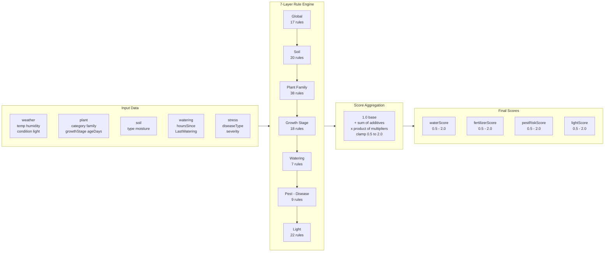
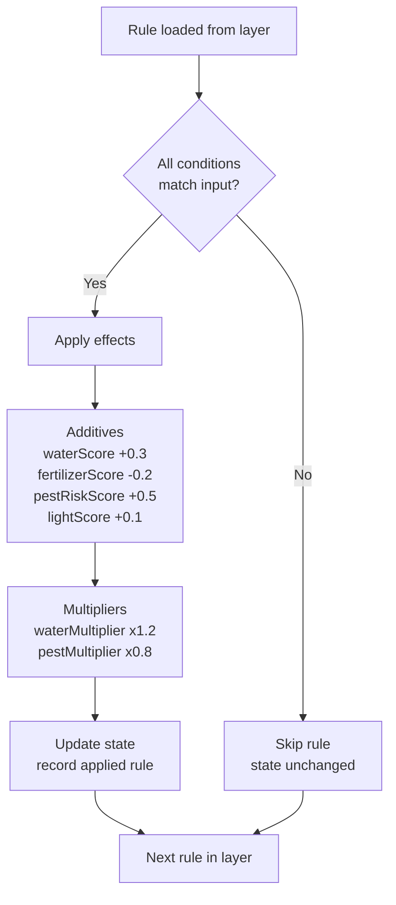
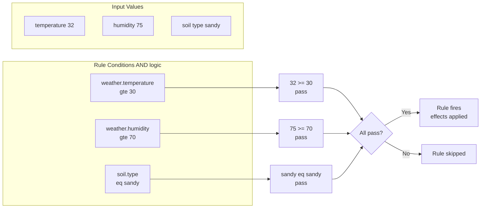
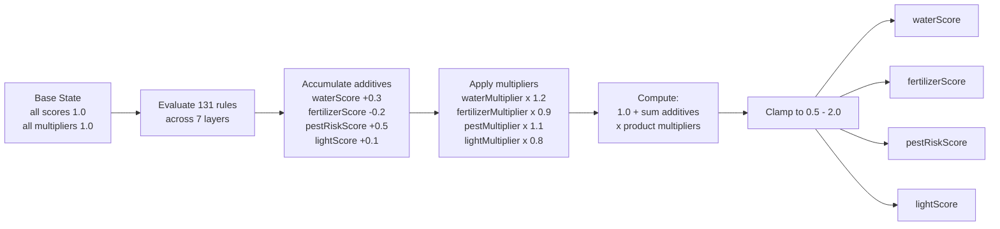

# Agri Rule Engine

Deterministic scoring engine for agricultural intelligence. Evaluates environmental, soil, plant, light, and pest inputs to compute four intensity scores: **waterScore**, **fertilizerScore**, **pestRiskScore**, and **lightScore**.



---

## Engine Structure

```
Backend/service/engine/
├── index.js           Entry point — layer ordering & public API
├── engine.js          Core engine — condition evaluation, rule application, score aggregation
├── global.js          Global weather-driven environment rules loader
├── soil.js            Soil modifier rules loader
├── plantFamilies.js   Plant family sensitivity rules loader
├── growthStages.js    Growth stage modifier rules loader
├── watering.js        Watering history modifier rules loader
├── pestDisease.js     Pest/disease cross-factor rules loader
├── light.js           Light exposure modifier rules loader
└── README.md          Comprehensive engine documentation
```

**Rule data** lives separately in `Backend/shared/rules/`:

| Module            | Source file                              |
| ----------------- | ---------------------------------------- |
| `global.js`       | `weather_global_rules.json`              |
| `soil.js`         | `weather_soil_modifiers.json`            |
| `plantFamilies.js`| `weather_plant_family_modifiers.json`    |
| `growthStages.js` | `weather_growth_stage_modifiers.json`    |
| `watering.js`     | `weather_watering_history_modifiers.json`|
| `pestDisease.js`  | `weather_pest_disease_modifiers.json`    |
| `light.js`        | `weather_light_modifiers.json`           |

---

## Module Functions

### `index.js` — Entry Point

| Function              | Returns                                          |
| --------------------- | ------------------------------------------------ |
| `evaluate(input)`     | `{ waterScore, fertilizerScore, pestRiskScore, lightScore, _appliedRules }` |
| `evaluateByLayer(input)` | `{ layers: { global, soil, ... }, final: { ... } }` |
| `getRuleCount()`      | `{ global: 17, soil: 20, plantFamily: 38, growthStage: 18, watering: 7, pest: 9, light: 22, total: 131 }` |

### `engine.js` — Core Engine

| Function                  | Purpose                                         |
| ------------------------- | ----------------------------------------------- |
| `evaluateRules(input, rules)` | Evaluates all rules against input → aggregated scores |
| `applyRule(rule, input, state)` | Checks a single rule's condition; merges effects on match |
| `evaluateCondition(condition, input)` | Resolves nested paths & checks operators (AND logic) |
| `createBaseState()`       | Returns base state with all scores/multipliers at 1.0 |
| `aggregateScores(state)`  | Applies formula + clamp → final scores           |

### Layer Loaders (e.g. `global.js`, `soil.js`, ...)

Each loader:
1. Imports its JSON rule file via `createRequire(import.meta.url)`
2. Maps raw rules into engine-ready objects (`id`, `layer`, `factor`, `condition`, `effect`, `weight`, `explainKey`)
3. Exports `layer` (string name) and `rules` (array)

---

## How It Works — Evaluation Flow

Rules are evaluated in a fixed **7-layer order**:

```
1. Global        (broad weather/environment)
2. Soil          (weather-soil interactions)
3. Plant Family  (family sensitivity modifiers)
4. Growth Stage  (family + stage specific)
5. Watering      (recency & drought/overwatering risk)
6. Pest/Disease  (disease & pest pressure modifiers)
7. Light         (light exposure modifiers)
→ Aggregation
```



This ordering reflects the dependency chain from broad environment → soil → plant → stress.

### Condition Evaluation

Each rule has a `condition` object with nested path keys (e.g. `weather.temperature`). Supported operators:

| Operator | Meaning      |
| -------- | ------------ |
| `eq`     | equals       |
| `neq`    | not equals   |
| `gte`    | >=           |
| `lte`    | <=           |
| `gt`     | >            |
| `lt`     | <            |

- Multiple operators on one key = AND
- Multiple keys in a condition = AND
- All conditions must pass for a rule to apply



### Rule Application

When a rule's condition passes, its `effects` are merged into the scoring state:

- **Additive** keys: `waterScore`, `fertilizerScore`, `pestRiskScore`, `lightScore` — added to current value
- **Multiplier** keys: `waterMultiplier`, `fertilizerMultiplier`, `pestMultiplier`, `lightMultiplier` — multiplied with current value

---

## Final Score Calculation

### Formula

```
finalScore = clamp((1.0 + sum(additives)) × product(multipliers), 0.5, 2.0)
```



### Base State

All scores start at `1.0`, all multipliers start at `1.0`:

```js
{
  waterScore: 1.0,
  fertilizerScore: 1.0,
  pestRiskScore: 1.0,
  lightScore: 1.0,
  waterMultiplier: 1.0,
  fertilizerMultiplier: 1.0,
  pestMultiplier: 1.0,
  lightMultiplier: 1.0
}
```

### Clamping

Final scores are clamped between **0.5** and **2.0**.

### Score Interpretation

| Value | Meaning       |
| ----- | ------------- |
| 0.5   | Low intensity |
| 1.0   | Baseline      |
| 1.5   | Elevated      |
| 2.0   | Severe (max)  |

---

## Input Object Structure

Only `weather` and `plant` are required. All other objects and their sub-fields are **optional** — omitting them simply skips the related rules, producing a coarser but still valid score.

```ts
{
  // ── Required ──────────────────────────────────────────────
  weather: {
    temperature: number,      // °C
    humidity: number,         // 0–100
    condition: string,        // "sunny" | "cloudy" | "rainy" | "storm"
    light: string,            // "shade" | "indirect" | "partial" | "full_sun" | "intense"
    windSpeed?: number        // m/s; omit → wind rules skip (optional)
  },

  plant: {
    category?: string,        // "crop" | "tree" | "flower" — triggers category-specific rules
    family: string,           // see Plant Families table
    ageDays: number,          // days since planted
    growthStage: string       // "germination" | "seedling" | "vegetative"
                              // | "flowering" | "fruiting" | "mature"
  },

  // ── Optional — improves accuracy when provided ────────────
  soil?: {                    // omit → all soil & moisture rules skip
    type: string,             // see Soil Types table
    moisture?: number         // 0–100; omit → only type-based rules fire
  },

  watering?: {                // omit → all watering history rules skip
    hoursSinceLastWatering: number  // hours
  },

  stress?: {                  // omit → all disease & severity rules skip
    diseaseType: string,      // "none" | "fungal" | "bacterial"
    severity?: string         // "none" | "medium" | "high"; omit → disease-type rules fire, severity rules skip
  }
}
```

### Optional Fields Behaviour

| Scenario | What fires | Accuracy |
|---|---|---|
| `soil` omitted entirely | No soil-layer rules | Baseline |
| `soil: { type }` only | Only type-based rules (e.g. `soil_sandy_water_leaching`) | Partial |
| `soil: { type, moisture }` | Type rules + moisture rules (e.g. `soil_low_moisture_drought_stress`) | Full |
| `watering` omitted entirely | No watering-layer rules | Baseline |
| `watering: { hoursSinceLastWatering }` only | Watering history rules (e.g. `watering_mild_drought`) | Partial |
| `watering + soil.moisture` | Over-saturation rules also fire (e.g. `watering_over_saturation_risk`) | Full |
| `stress` omitted entirely | No pest-layer disease/severity rules | Baseline |
| `stress: { diseaseType }` only | Only disease-type rules (e.g. `pest_fungal_humidity_high`) | Partial |
| `stress: { diseaseType, severity }` | Disease-type + severity rules (e.g. `pest_high_severity_amplification`) | Full |
| `weather.windSpeed` omitted | No wind rules fire | Baseline |
| `weather.windSpeed` provided | Wind ET rules fire (≥5.5 m/s, ≥11 m/s) | Improved water accuracy |

Each sub-field independently unlocks its own set of rules. Providing partial data gives **more accuracy than omitting the whole object**, but less than providing all sub-fields.

---

## Output Object Structure

### `evaluate(input)`

```js
{
  waterScore: 2.0,        // 0.5 – 2.0
  fertilizerScore: 1.8,   // 0.5 – 2.0
  pestRiskScore: 1.4,     // 0.5 – 2.0
  lightScore: 1.2,        // 0.5 – 2.0
  _appliedRules: [        // rules that matched
    { id: "rule_id", layer: "global", explainKey: "rule_id" },
    ...
  ]
}
```

### `evaluateByLayer(input)`

```js
{
  layers: {
    global:     { waterScore, fertilizerScore, pestRiskScore, lightScore, _appliedRules },
    soil:       { ... },
    plantFamily:{ ... },
    growthStage:{ ... },
    watering:   { ... },
    pest:       { ... },
    light:      { ... }
  },
  final: { waterScore, fertilizerScore, pestRiskScore, lightScore, _appliedRules }
}
```

### `getRuleCount()`

```js
{ global: 17, soil: 20, plantFamily: 38, growthStage: 18, watering: 7, pest: 9, light: 22, total: 131 }
```

---

## Rule JSON Schema

Each rule file contains a `rules` array. A single rule:

```json
{
  "id": "unique_id",
  "explainKey": "unique_id",
  "factor": "weather",
  "condition": {
    "weather.temperature": { "gte": 30, "lt": 35 },
    "soil.type": { "eq": "sandy" },
    "plant.family": { "eq": "leafy_greens" }
  },
  "effects": {
    "waterScore": 0.3,
    "waterMultiplier": 1.2,
    "fertilizerScore": 0.2,
    "pestRiskScore": 0.4
  },
  "weight": 0.5,
  "explanation": "Human-readable description"
}
```

### Field Reference

| Field         | Description                            |
| ------------- | -------------------------------------- |
| `id`          | Unique string identifier               |
| `factor`      | Descriptive category (e.g. "weather")  |
| `condition`   | Nested path → operator → threshold map |
| `effects`     | Additive & multiplier score changes    |
| `weight`      | Numeric weight from source data        |
| `explanation` | Human-readable rationale               |
| `explainKey`  | Short identifier for client-side i18n mapping   |

### Effect Types

| Key                    | Type           | Effect                       |
| ---------------------- | -------------- | ---------------------------- |
| `waterScore`           | additive       | +/– to water score           |
| `fertilizerScore`      | additive       | +/– to fertilizer score      |
| `pestRiskScore`        | additive       | +/– to pest risk score       |
| `waterMultiplier`      | multiplicative | × factor on water score      |
| `fertilizerMultiplier` | multiplicative | × factor on fertilizer score |
| `pestMultiplier`       | multiplicative | × factor on pest risk score  |
| `lightScore`           | additive       | +/– to light score           |
| `lightMultiplier`      | multiplicative | × factor on light score      |

---

## Reference Tables

### Plant Families

| Family                | Water Sensitivity | Nutrient Demand | Pest Susceptibility | Conditional Effects |
| --------------------- | :---------------: | :-------------: | :-----------------: | ------------------- |
| leafy_greens          |       1.3×        |    baseline     |        +0.2         | —                   |
| fruiting_nightshade   |       1.2×        |      +0.2       |      baseline       | —                   |
| succulent             |       0.5×        |    baseline     |        -0.2         | drought_dormancy: waterScore -1.5 (≥72h no water) |
| root_crops            |       1.1×        |      +0.1       |      baseline       | —                   |
| brassicas             |       1.2×        |    baseline     |        +0.3         | —                   |
| legumes               |       0.8×        |      -0.2       |      baseline       | —                   |
| herbs                 |       0.7×        |    baseline     |        -0.2         | —                   |
| tropical              |       1.4×        |    baseline     |        +0.2         | heat_humidity_tolerance: pestRiskScore -0.3 (≥28°C & ≥70% humidity) |
| citrus                |       1.1×        |    baseline     |        +0.2         | —                   |
| vines                 |       1.0×        |    baseline     |        +0.2         | —                   |
| grasses               |       0.8×        |      +0.2       |      baseline       | —                   |
| flowering_ornamentals |       1.0×        |    baseline     |        +0.2         | —                   |
| **cucurbits**         |     **1.3×**      |    **+0.2**     |      **+0.3**       | —                   |
| **alliums**           |     **0.9×**      |    **+0.2**     |      **-0.1**       | —                   |
| **berries**           |     **1.2×**      |    **+0.2**     |      **+0.2**       | —                   |
| **palm**              |     **0.8×**      |    **+0.1**     |      baseline       | pest_resistance: pestRiskScore -0.2 (always) |

### Light Levels

| Level      | Description                                    |
| ---------- | ---------------------------------------------- |
| shade      | Deep shade — minimal direct light              |
| indirect   | Indirect / filtered light — under canopy       |
| partial    | Partial sun — 3-6 hours direct light           |
| full_sun   | Full sun — 6+ hours direct light               |
| intense    | Intense direct sunlight — midday desert-like   |

### Soil Types

| Type        | Water Effect | Fertilizer Effect | Pest Effect |
| ----------- | :----------: | :---------------: | :---------: |
| sandy       |     +0.3     |       +0.2        |    -0.1     |
| aridisols   |     +0.5     |       +0.3        |      —      |
| entisols    |     -0.1     |       -0.2        |      —      |
| inceptisols |     +0.1     |       +0.2        |      —      |
| alfisols    |     -0.2     |       -0.1        |      —      |
| vertisols   |     +0.3     |       +0.1        |      —      |
| **loam**    |  **+0.0**    |     **-0.1**      |      —      |
| **clay**    |  **-0.2**    |     **-0.1**      |      —      |
| **silt**    |  **+0.1**    |     **+0.1**      |      —      |

---

## Usage Example

```js
import { evaluate, evaluateByLayer, getRuleCount } from "./engine/index.js";

// Full input — all optional fields provided
const full = {
  weather: { temperature: 32, humidity: 35, condition: "sunny", light: "full_sun", windSpeed: 4.2 },
  soil: { type: "sandy", moisture: 15 },
  plant: { category: "crop", family: "leafy_greens", ageDays: 30, growthStage: "vegetative" },
  watering: { hoursSinceLastWatering: 48 },
  stress: { diseaseType: "none", severity: "none" },
};
console.log(evaluate(full));
// { waterScore: 2.0, fertilizerScore: 1.8, pestRiskScore: 1.4, ... }

// Minimal input — only required fields
const minimal = {
  weather: { temperature: 20, humidity: 50, condition: "cloudy", light: "indirect" },
  plant: { category: "tree", family: "citrus", growthStage: "flowering", ageDays: 200 },
};
console.log(evaluate(minimal));
// Still returns valid scores (fewer rules fire, less accurate)

const layered = evaluateByLayer(full);
console.log(layered.layers.global);
console.log(layered.final);

console.log(getRuleCount());
// { global: 17, soil: 20, plantFamily: 38, growthStage: 18, watering: 7, pest: 9, light: 22, total: 131 }
```

---

## Engine Test Report

### Overview

The deterministic scoring engine was tested with **16 test cases** covering all 7 layers (global, soil, plantFamily, growthStage, watering, pest, light) across diverse environmental, soil, plant, and stress conditions including wind ET rules, overwatering detection, succulent CAM-idling dormancy, and tropical climate adaptation.

**Rule counts:** global=17, soil=20, plantFamily=38, growthStage=18, watering=7, pest=9, light=22 — **131 total rules**.

Following an agronomic audit, 3 family-level rules were added and 2 growth-stage multipliers were reduced to prevent false water caps in optimal conditions and correctly model plant-adapted pest responses.

### Test Results Summary

| TC  | Scenario                                              | Water | Fertilizer | Pest  | Light | Rules |
| :-: | ----------------------------------------------------- | :---: | :--------: | :---: | :---: | :---: |
| 01  | Optimal — Leafy greens, loam, vegetative, cloudy      | 1.570 | 1.600      | 1.000 | 1.100 | 9     |
| 02  | Extreme — Heat 38°C, sandy, drought 96h, intense      | 2.000 | 2.000      | 2.000 | 2.000 | 18    |
| 03  | Cold — 8°C, rainy, alfisols, mature                   | 0.500 | 0.500      | 2.000 | 0.500 | 15    |
| 04  | Storm — Fungal, high severity, vertisols, fruiting    | 1.498 | 2.000      | 2.000 | 0.500 | 14    |
| 05  | Desert — Succulent, aridisols, 168h drought           | 1.360 | 1.300      | 2.000 | 1.430 | 18    |
| 06  | Tropical — Entisols, rainy, germination               | 0.500 | 0.800      | 1.800 | 0.700 | 12    |
| 07  | Legumes — Vegetative, inceptisols, optimal            | 1.008 | 1.200      | 0.800 | 1.100 | 10    |
| 08  | Worst-case — Bacterial, heat 35°C, drought 120h       | 2.000 | 2.000      | 2.000 | 1.820 | 17    |
| 09  | Herbs — Flowering, pest-resistant                     | 1.178 | 1.500      | 0.500 | 1.200 | 11    |
| 10  | Storm — Vertisols, seedling, high moisture            | 0.660 | 1.400      | 2.000 | 0.500 | 15    |
| 11  | Grasses — Fungal medium severity, 48h drought         | 1.260 | 1.800      | 1.400 | 1.300 | 10    |
| 12  | Minimal — No watering/stress input, citrus, flowering | 1.573 | 1.500      | 1.000 | 0.900 | 8     |
| 13  | **Wind** — High ET, wind 7.2 m/s, sandy, drought      | 2.000 | 1.800      | 1.900 | 1.300 | 17    |
| 14  | **Overwatering** — Clay, cucurbits, rainy, cool       | 0.500 | 1.300      | 2.000 | 0.500 | 12    |
| 15  | **Berries+Silt** — Moderate, fruiting                 | 1.728 | 1.700      | 1.000 | 1.100 | 9     |
| 16  | **Palm+Intense** — Mature, drought, high light        | 2.000 | 1.000      | 2.000 | 1.820 | 14    |

### Detailed Per-Layer Breakdown

#### TC-01: Optimal / Baseline Conditions
```
Input:        temp=25°C  hum=55%  cloudy  |  loam  moist=50%  |  leafy_greens  vegetative  30d  |  18h  |  none/none
Final:        water=1.570   fert=1.600   pest=1.000   light=1.100
  global      +0.0 water  +0.1 fert                            [optimal_temp_baseline]
  soil        -0.1 pest  +0.0 water  -0.1 fert                 [optimal_moisture, loam_balanced]
  plantFamily ×1.3 water  +0.2 pest                            [water_sensitivity, pest_susceptibility]
  growthStage ×1.05×1.15 water  +0.3+0.3 fert                 [vegetative_demand, vegetative_leafy_greens]
  watering    (no rules matched)
  pest        -0.1 pest                                         [optimal_growth_suppression]
  light       +0.1 light                                        [general_partial]
```
9 rules applied. Water multiplier reduced from 1.2→1.05 (general vegetative) and 1.4→1.15 (leafy greens vegetative) so water no longer hits cap in optimal conditions. New water=1.570 vs previous 2.000 — realistic "slightly elevated" for actively growing leafy greens.

---

#### TC-02: Extreme Heat + Low Humidity + Sandy Soil + Drought
```
Input:        temp=38°C  hum=25%  sunny  |  sandy  moist=10%  |  leafy_greens  vegetative  30d  |  96h  |  none/none  |  intense
Final:        water=2.000   fert=2.000   pest=2.000   light=2.000
  global      +0.5 water  +0.4 water  +0.3 water  +0.2 water   [extreme_heat, dry_heat, low_humidity, sunny]
  soil        +0.3 water  +0.2 fert  -0.1 pest  +0.3 water     [sandy_water, sandy_fert, sandy_pest, low_moisture]
  plantFamily ×1.3 water  +0.2 pest
  growthStage ×1.05×1.15 water  +0.3+0.3 fert
  watering    +0.5 water  +0.7 water  +0.3 pest                 [drought_high, drought_recovery, heat_drought]
  pest        +0.2 pest  +0.2 water  +0.3 pest                 [heat_reproduction, stress_vulnerability]
  light       +0.3 pest  +1.0 light                             [general_intense, leafy_greens_intense_burn]
```
All four scores still hit cap (2.000). 18 rules matched — the multiplier reductions do not prevent extreme scenarios from maxing out, as expected.

---

#### TC-03: Cold + Rainy + Alfisols (Clay) + Mature
```
Input:        temp=8°C  hum=90%  rainy  |  alfisols  moist=85%  |  brassicas  mature  120d  |  6h  |  none/none
Final:        water=0.500   fert=0.500   pest=2.000   light=0.500
  global      -0.2 water  -0.2 fert  -0.3 water  +0.4 pest     [cold, high_humidity, rainy, fungal_risk]
  soil        -0.2 water  -0.1 fert  +0.2 water  +0.3 pest     [alfisols_drainage, alfisols_waterlogging, high_moisture]
  plantFamily ×1.2 water  +0.3 pest
  growthStage ×0.8 water  -0.2 fert  +0.2 pest                 [mature_reduced, mature_senescence]
  watering    -0.2 water  +0.3 pest                             [recently_watered, over_saturation_risk]
  pest        +0.3 pest                                         [soil_borne_moisture]
  light       -0.5 light                                        [general_shade]
```
Water/fertilizer crash to 0.500. Pest hits 2.000. Unchanged from previous run.

---

#### TC-04: Fungal Disease + High Humidity + Storm
```
Input:        temp=28°C  hum=88%  storm  |  vertisols  moist=75%  |  fruiting_nightshade  fruiting  60d  |  12h  |  fungal/high
Final:        water=1.498   fert=2.000   pest=2.000   light=0.500
  global      -0.4 water  +0.1 fert  +0.4+0.3+0.2 pest         [storm, optimal_temp, fungal_risk, heat_humidity_pest]
  soil        +0.3 water  +0.1 fert  +0.4 pest                 [vertisols_swelling, vertisols_waterlogged]
  plantFamily ×1.2 water  +0.2 fert
  growthStage ×1.2×1.3 water  +0.3+0.3 fert  +0.2 pest        [fruiting_water, nightshade_fruiting]
  watering    (no rules matched)
  pest        +0.5 pest  +0.5 pest                             [fungal_humidity_high, high_severity]
  light       -0.5 light                                        [general_shade]
```
Unchanged from previous run. Fungal + high severity + fruiting nightshade remains extreme.

---

#### TC-05: Desert Conditions with Succulent
```
Input:        temp=33°C  hum=15%  sunny  |  aridisols  moist=8%  |  succulent  mature  365d  |  168h  |  none/none  |  intense
Final:        water=1.360   fert=1.300   pest=2.000   light=1.430
  global      +0.3+0.3+0.4+0.2 water                           [high_heat, low_humidity, dry_heat, sunny]
  soil        +0.5 water  +0.3 fert  +0.3 water                [aridisols_desert, low_moisture]
  plantFamily ×0.5 water  -0.2 pest  -1.5 water                [succulent_low_water, pest_resistance, drought_dormancy]
  growthStage ×0.8 water  -0.2 fert  +0.2 pest                 [mature_reduced, senescence]
  watering    +0.5+0.7 water  +0.2 fert  +0.3 pest             [drought_high, drought_recovery, heat_drought]
  pest        +0.2+0.2+0.3 pest                                [heat_reproduction, stress_vulnerability]
  light       -0.1 pest  +0.43 light                            [succulent_intense_optimal]
```
Added `family_succulent_drought_dormancy` (−1.5 waterScore at ≥72h without water) simulating CAM-idling metabolic shutdown. Water score dropped from 1.960→1.360 — still elevated due to intense heat and aridisols, but no longer near-cap. Agronomically: a succulent in 7-day drought is stressed but far from critical.

---

#### TC-06: Tropical Germination in Rainy River Basin
```
Input:        temp=30°C  hum=75%  rainy  |  entisols  moist=70%  |  tropical  germination  5d  |  4h  |  none/none
Final:        water=0.500   fert=0.800   pest=1.800   light=0.700
  global      +0.3 water  -0.5 water  +0.3 pest                [high_heat, rainy, heat_humidity_pest]
  soil        -0.1 water  -0.2 fert  +0.3 pest                 [entisols_fertility, entisols_flood_risk]
  plantFamily ×1.4 water  +0.2 pest  -0.3 pest                 [tropical_water, humidity_requirement, heat_humidity_tolerance]
  growthStage (no rules — no germination rules for tropical)
  watering    -0.2 water  +0.1 pest                             [recently_watered]
  pest        +0.2 pest                                         [heat_reproduction]
  light       -0.3 light                                        [tropical_indirect_optimal]
```
Added `family_tropical_heat_humidity_tolerance` (−0.3 pestRiskScore when temp≥28°C and humidity≥70%). This cancels the `global_heat_humidity_pest_acceleration` (+0.3) for tropical plants, reflecting their evolutionary adaptation. Pest score dropped from 2.000→1.800. The remaining pest pressure comes from entisols flood risk (+0.3), plant humidity requirement (+0.2), and heat reproduction (+0.2).

---

#### TC-07: Legumes with Low Fertilizer Demand
```
Input:        temp=22°C  hum=60%  cloudy  |  inceptisols  moist=45%  |  legumes  vegetative  25d  |  24h  |  none/none
Final:        water=1.008   fert=1.200   pest=0.800   light=1.100
  global      +0.0 water  +0.1 fert                             [optimal_temp]
  soil        +0.1 water  +0.2 fert  -0.1 pest                 [inceptisols, optimal_moisture]
  plantFamily ×0.8 water  -0.2 fert                             [legumes_low_water, nitrogen_fixation]
  growthStage ×1.05 water  +0.1 fert                            [vegetative_demand, legumes_nitrogen]
  watering    +0.1 water                                        [mild_drought]
  pest        -0.1 pest                                         [optimal_growth_suppression]
  light       +0.1 light                                        [general_partial]
```
Water score dropped from 1.152→1.008 due to the reduced vegetative multiplier (1.2→1.05). Combined with legumes' natural ×0.8 multiplier, water stays near baseline — correct for a drought-tolerant legume at 24h mild drought.

---

#### TC-08: Bacterial Disease + Extreme Heat + Drought
```
Input:        temp=35°C  hum=72%  sunny  |  sandy  moist=5%  |  fruiting_nightshade  fruiting  70d  |  120h  |  bacterial/high  |  intense
Final:        water=2.000   fert=2.000   pest=2.000   light=1.820
  global      +0.5+0.2 water  +0.3 pest                        [extreme_heat, sunny, heat_humidity_pest]
  soil        +0.3 water  +0.2 fert  -0.1 pest  +0.3 water     [sandy_water, sandy_fert, sandy_pest, low_moisture]
  plantFamily ×1.2 water  +0.2 fert
  growthStage ×1.2×1.3 water  +0.3+0.3 fert  +0.2 pest        [fruiting, nightshade_fruiting]
  watering    +0.5+0.7 water  +0.2 fert  +0.3 pest             [drought_high, drought_recovery, heat_drought]
  pest        +0.4+0.4+0.3 pest  +0.2 water                    [bacterial_heat, high_severity, stress_vulnerability]
  light       +0.82 light                                       [general_intense]
```
Triple cap (water, fert, pest). Unchanged — bacterial disease + 120h drought at 35°C is genuinely catastrophic.

---

#### TC-09: Herbs with Pest Resistance
```
Input:        temp=26°C  hum=40%  sunny  |  sandy  moist=30%  |  herbs  flowering  45d  |  36h  |  none/none
Final:        water=1.178   fert=1.500   pest=0.500   light=1.200
  global      +0.0 water  +0.2 water  +0.1 fert                [optimal_temp, sunny]
  soil        +0.3 water  +0.2 fert  -0.1 pest                 [sandy_water, sandy_fert, sandy_pest]
  plantFamily ×0.7 water  -0.2 pest                             [herbs_low_water, pest_resistance]
  growthStage ×0.9 water  +0.2 fert  -0.1 pest                 [flowering_sensitivity, herbs_aromatic]
  watering    +0.1 water                                        [mild_drought]
  pest        (no rules matched)
  light       -0.1 pest  +0.2 light                             [herbs_full_sun_optimal]
```
Lowest pest score (0.500). Unchanged from previous run.

---

#### TC-10: Storm on Vertisols with Seedling
```
Input:        temp=34°C  hum=82%  storm  |  vertisols  moist=90%  |  root_crops  seedling  10d  |  8h  |  none/none
Final:        water=0.660   fert=1.400   pest=2.000   light=0.500
  global      +0.3-0.3-0.4 water  +0.2 pest                    [high_heat, high_humidity, storm, heat_humidity_pest]
  soil        +0.3+0.3+0.4 water  +0.3+0.4 pest                [vertisols_swelling, dry_cracking, waterlogged, high_moisture]
  plantFamily ×1.1 water  +0.1 fert
  growthStage +0.2 pest                                         [seedling_vulnerability]
  watering    -0.2 water  +0.3 pest                             [recently_watered, over_saturation_risk]
  pest        +0.2 pest                                         [heat_reproduction]
  light       -0.5 light                                        [general_shade]
```
Unchanged from previous run.

---

#### TC-11: Fungal Medium Severity on Grasses
```
Input:        temp=27°C  hum=65%  cloudy  |  inceptisols  moist=55%  |  grasses  vegetative  40d  |  48h  |  fungal/medium
Final:        water=1.260   fert=1.800   pest=1.400   light=1.300
  global      +0.0 water  +0.1 fert                             [optimal_temp]
  soil        +0.1 water  +0.2 fert  -0.1 pest                 [inceptisols, optimal_moisture]
  plantFamily ×0.8 water  +0.2 fert                             [grasses, grasses_nutrient]
  growthStage ×1.05 water  +0.1 fert                            [vegetative_demand]
  watering    +0.3 water                                        [drought_moderate]
  pest        +0.2+0.2 pest                                     [fungal_moderate, medium_severity]
  light       +0.3 light                                        [general_full_sun]
```
Water score dropped from 1.440→1.260 due to reduced vegetative multiplier (1.2→1.05). Moderate stress scenario — grasses' drought tolerance (×0.8) keeps water manageable.

---

#### TC-12: Minimal Input — No Watering or Stress
```
Input:        temp=20°C  hum=50%  cloudy  |  sandy  moist=40%  |  citrus  flowering  200d  |  (none)  |  (none)
Final:        water=1.573   fert=1.500   pest=1.000   light=0.900
  global      +0.0 water  +0.1 fert                             [optimal_temp]
  soil        +0.3 water  +0.2 fert  -0.1-0.1 pest              [sandy_water, sandy_fert, sandy_pest, optimal_moisture]
  plantFamily ×1.1 water  +0.2 pest                             [citrus_water, citrus_pest]
  growthStage ×1.1 water  +0.2 fert                             [flowering_demand]
  watering    (no rules — no watering input)
  pest        (no rules — no stress input)
  light       -0.1 light                                        [general_indirect]
```
Unchanged from previous run. Engine handles missing keys gracefully.

---

#### TC-13: Wind + High ET — High Evapotranspiration
```
Input:        temp=32°C  hum=20%  sunny  |  sandy  moist=12%  |  leafy_greens  vegetative  30d  |  72h  |  none/none  |  wind=7.2m/s
Final:        water=2.000   fert=1.800   pest=1.900   light=1.300
  global      +0.5+0.4+0.3+0.2+0.3 water                       [extreme_heat, low_humidity, dry_heat, sunny, strong_wind_et]
  soil        +0.3 water  +0.2 fert  -0.1 pest  +0.3 water     [sandy, sandy_fert, sandy_pest, low_moisture]
  plantFamily ×1.3 water  +0.2 pest
  growthStage ×1.05×1.15 water  +0.3+0.3 fert                  [vegetative, leafy_greens]
  watering    +0.5+0.7 water  +0.3 pest                         [drought_high, heat_drought_compound]
  pest        +0.2+0.2+0.3 pest                                [heat_reproduction, stress_vulnerability]
  light       +0.3 light                                        [general_full_sun]
```
Water still caps at 2.000 due to 5 global water additives (+1.7 total) + 2 soil (+0.6) + 2 watering (+1.2) overwhelming the multipliers. Extreme wind + drought at 32°C is legitimately critical.

---

#### TC-14: Overwatering — Clay + Recent Watering + Cool
```
Input:        temp=18°C  hum=85%  rainy  |  clay  moist=90%  |  cucurbits  flowering  40d  |  2h  |  none/none
Final:        water=0.500   fert=1.300   pest=2.000   light=0.500
  global      -0.2-0.2-0.5 water  +0.4 pest                    [cool_temp, high_humidity, rainy, fungal_risk]
  soil        -0.5 water  -0.1 fert  +0.3 pest                 [high_moisture_saturation, clay_slow_drainage]
  plantFamily ×1.3 water  +0.2 fert  +0.3 pest                 [cucurbits_water_demand, cucurbits_pest]
  growthStage ×1.1 water  +0.2 fert                             [flowering_demand]
  watering    -0.2 water  +0.3 pest                             [recently_watered, over_saturation_risk]
  pest        (no rules matched)
  light       -0.5 light                                        [general_shade]
```
Unchanged — still correctly identifies overwatering with pest risk.

---

#### TC-15: Berries + Silt — Moderate Conditions
```
Input:        temp=24°C  hum=65%  cloudy  |  silt  moist=55%  |  berries  fruiting  90d  |  36h  |  none/none
Final:        water=1.728   fert=1.700   pest=1.000   light=1.100
  global      +0.0 water  +0.1 fert                             [optimal_temp]
  soil        +0.1 water  +0.1 fert  -0.1 pest                 [optimal_moisture, silt_moderate_retention]
  plantFamily ×1.2 water  +0.2 fert  +0.2 pest                 [berries_water, berries_pest]
  growthStage ×1.2 water  +0.1 fert                             [fruiting_demand]
  watering    +0.1 water                                        [mild_drought]
  pest        -0.1 pest                                         [optimal_growth_suppression]
  light       +0.1 light                                        [general_partial]
```
Unchanged — water at 1.728 reflects berries' ×1.2 sensitivity combined with fruiting stage ×1.2.

---

#### TC-16: Palm + Intense Light — Light Score Focus
```
Input:        temp=35°C  hum=30%  sunny  |  loam  moist=25%  |  palm  mature  500d  |  96h  |  none/none  |  intense
Final:        water=2.000   fert=1.000   pest=2.000   light=1.820
  global      +0.5+0.4+0.2 water                                [extreme_heat, low_humidity, sunny]
  soil        +0.0 water  -0.1 fert                             [loam_balanced]
  plantFamily ×0.8 water  +0.1 fert  -0.2 pest                  [palm_drought_tolerance, palm_pest_resistance]
  growthStage ×0.8 water  -0.2 fert  +0.2 pest                 [mature_reduced, senescence]
  watering    +0.5+0.7 water  +0.2 fert  +0.3 pest             [drought_high, drought_recovery, heat_drought]
  pest        +0.2+0.2+0.3 pest                                [heat_reproduction, stress_vulnerability]
  light       +0.82 light                                       [general_intense]
```
Added `family_palm_pest_resistance` (−0.2 pestRiskScore). Pest still hits 2.000 due to drought (96h) + heat (35°C) stress signals, but the resistance reduces the raw score from 2.2→2.0 (would be clamped either way). In less extreme conditions the resistance will keep pest below cap. Water stays capped from extreme drought.

---

### Key Observations

1. **All four scores can hit 2.000 (cap)** under extreme conditions (TC-02, TC-08). The cap prevents unbounded scores.

2. **Water cap fix (TC-01)**: Previously 2.000 in optimal conditions due to aggressive multiplier stacking (×1.3×1.2×1.4 = 2.184). Reducing vegetative multipliers (1.2→1.05, 1.4→1.15) drops water to 1.570 — realistic "slightly elevated" for actively growing leafy greens.

3. **Succulent CAM-idling dormancy (TC-05)**: New rule `family_succulent_drought_dormancy` (−1.5 waterScore at ≥72h drought) captures metabolic shutdown. Water drops from 1.960→1.360 — stressed but not critical, matching real succulent physiology.

4. **Tropical climate adaptation (TC-06)**: New rule `family_tropical_heat_humidity_tolerance` (−0.3 pestScore at ≥28°C/≥70% humidity) neutralizes the global pest acceleration rule for tropical plants. Pest drops from 2.000→1.800.

5. **Palm pest resistance (TC-16)**: New rule `family_palm_pest_resistance` (−0.2 pestScore) provides baseline protection. Pest stays at 2.000 in extreme drought but will differentiate in moderate conditions.

6. **Light layer** has 22 rules — scores range from 0.500 (shade) to 2.000 (intense + family burn risk).

7. **Wind ET rules** fire correctly at ≥5.5 m/s (TC-13), adding +0.3 water score.

8. **Over-saturation detection** (`watering_over_saturation_risk`) fires on recent watering + high moisture (TC-03, TC-10, TC-14).

9. **Cucurbits** have the highest pest susceptibility (+0.3) — matches agricultural profile (powdery mildew, downy mildew).

10. **Engine handles missing optional keys gracefully** (TC-12) — no crash when watering or stress absent.

11. **Pest risk is the easiest score to max out** — high humidity, waterlogged soil, family susceptibility, and disease severity compound rapidly. Even with tropical tolerance, TC-06 pest is 1.800.

12. **Layer stacking** — additives accumulate across all layers, then multipliers compound at the end. A large additive sum from early layers (e.g., global+soil+watering) can overwhelm small multipliers (e.g., succulent ×0.5), which is why the dormancy rule was added as an additive offset rather than a multiplier.

---

## Extending the Engine

**To add a new factor (e.g. `nutrient`):**
1. Create `rules/weather_nutrient_modifiers.json`
2. Create `engine/nutrient.js`
3. Register it in `engine/index.js` `LAYER_ORDER`

**To add a new soil type / plant family:** add rules to the corresponding JSON file.

**To add a new layer:** create the module, import in `index.js`, add to `LAYER_ORDER`.

---

## Requirements

- Node.js >= 20.x
- No external dependencies
